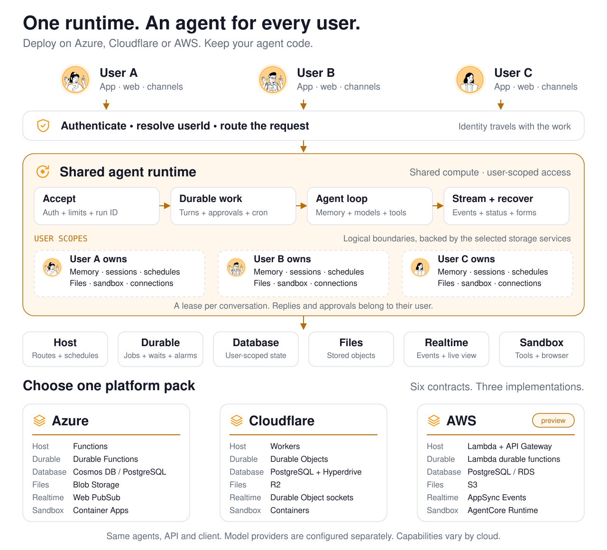
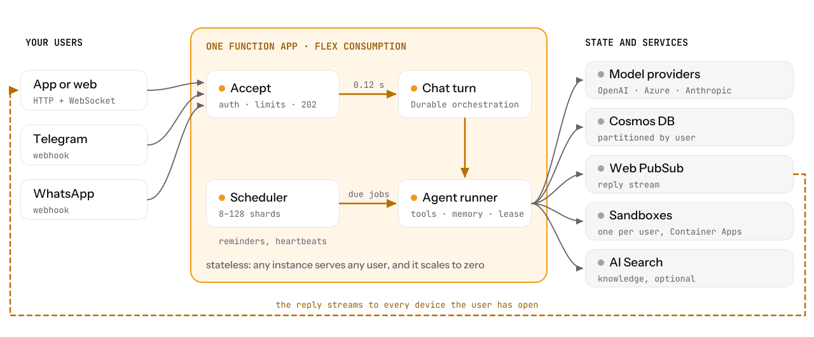
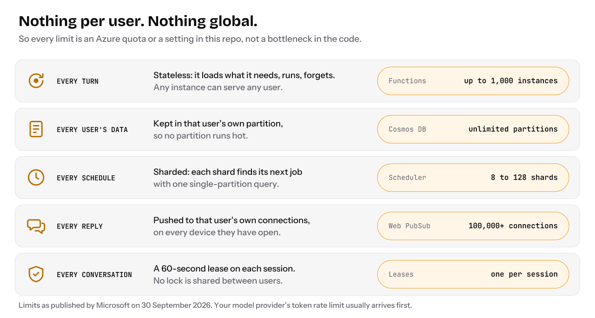
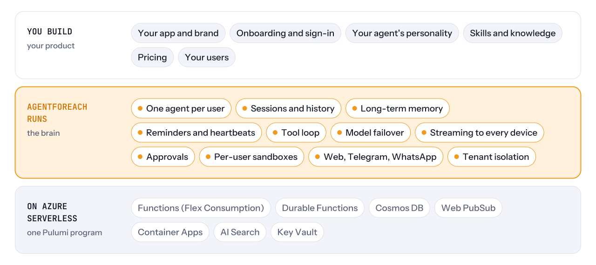

<p align="center">
  <picture>
    <source media="(prefers-color-scheme: dark)" srcset="docs/assets/banner-dark.svg">
    
  </picture>
</p>

<p align="center"><code>users.forEach(user =&gt; agent(user))</code></p>

<h3 align="center">An agent for every user. On your cloud.</h3>

<p align="center">Give every user an agent that remembers them, follows up while they're away and uses tools on their behalf.<br>You build the experience. AgentForEach supplies the memory, schedules, approvals and private workspaces.<br>Run the shared platform on <b>Azure, Cloudflare or AWS</b>, with state and work scoped to each user.</p>

<p align="center">
  <a href="https://github.com/agentforeach/agentforeach/actions/workflows/ci.yml"></a>
  <a href="https://github.com/agentforeach/agentforeach/releases"></a>
  <a href="LICENSE"></a>
  <a href=".github/workflows/ci.yml"></a>
</p>

<p align="center">
  <a href="docs/getting-started.md"></a>
  <a href="docs/Cloudflare.md"></a>
  <a href="docs/AWS.md"></a>
</p>

<p align="center">
  <a href="#quick-start"><b>Try it</b></a> ·
  <a href="#whats-new">What's new</a> ·
  <a href="#architecture">Architecture</a> ·
  <a href="#your-agent-in-code">See the code</a> ·
  <a href="docs/README.md">Docs</a> ·
  <a href="https://github.com/agentforeach/agentforeach/discussions">Talk to us</a>
</p>

<p align="center"></p>
<p align="center"><sub>Memory → an approval → a reminder → remembered context.<br>Recorded on a deployed Azure stack using the <a href="examples/web-chat/">web chat sample</a>.</sub></p>

## What's new

- **Oct 5, 2026 · AWS joins the platform layer.** The same gateway now runs on Lambda, with durable work, S3 files, AppSync Events and AgentCore sandboxes. The shared browser and realtime client work on AWS too. A fresh deployment passed functional checks plus worker timeout/retry, active-turn reconnect, pending forms across a release and an eight-minute browser handoff with image-version recovery. [AWS](docs/AWS.md) · [What was tested](docs/AWS-Validation.md)
- **Oct 5 · Runs and approvals recover more cleanly.** Follow a turn's status, recover unanswered forms after reconnecting, and resume an answer once. Queued turns reject stale work, and scheduled jobs recheck their current definition before running. These changes live in the shared core. [Sessions](docs/Session-management.md) · [Human in the loop](docs/HITL.md) · [Upgrade notes](docs/UPGRADING.md)
- **Oct 2 · Cloudflare and PostgreSQL.** Cloud packs implement six shared contracts; the same agents run on Azure or Cloudflare. Cosmos DB and PostgreSQL with pgvector pass the same storage suite. [Platforms](docs/Platforms.md) · [Database](docs/Database.md)
- **Oct 1 · A real browser for every agent.** Chromium reads pages, clicks, types and handles files inside the user's sandbox. For a step the user needs to take, the agent hands over the live browser and continues after Done. Off by default. [Browser](docs/Browser.md)

<details>
<summary>Earlier updates</summary>

- **Sep 30 · One-command quickstart** and a web chat sample with approval forms and reminders.
- **Sep 30 · Backend review.** Scheduler, billing, sessions, approvals and credential handling received fixes recorded in [UPGRADING.md](docs/UPGRADING.md).
- **Sep 29 · Open source**, Apache-2.0, in preview.

</details>

**Next:** local development without an Azure account, a starter app you can rebrand, and a Google Cloud pack. [Roadmap](ROADMAP.md)

## Architecture

**One shared runtime. An agent for every user. Your choice of cloud.** The gateway, agent loop, workflows and client use six platform contracts; Azure, Cloudflare and AWS implement them with their own services.

<picture>
  <source media="(max-width: 640px) and (prefers-color-scheme: dark)" srcset="docs/assets/architecture-platform-mobile-dark.svg">
  <source media="(max-width: 640px)" srcset="docs/assets/architecture-platform-mobile-light.svg">
  <source media="(prefers-color-scheme: dark)" srcset="docs/assets/architecture-platform-dark.svg">
  
</picture>

[Open the full diagram](docs/assets/architecture-platform-light.svg) · [Cloud services and capabilities](docs/Platforms.md)

### How users stay separate

A tenant here is a canonical `userId`. Users share compute and infrastructure; the runtime carries the authenticated owner's identity through their work:

- **Identity:** app sign-in and paired channel accounts resolve to the same user. Requests use that identity to check ownership.
- **State:** sessions, memories and schedules use user-scoped storage. Files and sandbox identifiers include their owner; this does not require a database or an always-on server per user.
- **Work and replies:** a renewed lease serializes turns within a conversation. Approval answers belong to the requesting user, and realtime events target that user's connections. Reconnects can recover run status and unanswered forms.

Deploy **one cloud pack** in your account. Model providers are configured independently of the hosting cloud, and backend capabilities differ. [Azure](docs/getting-started.md) · [Cloudflare](docs/Cloudflare.md) · [AWS, preview](docs/AWS.md) · [Security model](SECURITY.md)

<details>
<summary><b>Azure reference: the detailed request and reply path</b></summary>

<picture>
  <source media="(prefers-color-scheme: dark)" srcset="docs/assets/architecture-dark.svg">
  
</picture>

The Azure implementation uses Functions, Durable Functions, Cosmos DB or PostgreSQL, Web PubSub and Container Apps. The other packs fill the same roles with the services shown above.

</details>

[Architecture details](docs/Architecture.md) · [Sessions](docs/Session-management.md) · [Approvals](docs/HITL.md)

## Hyperscale by design

An agent is a user's state and work, with compute allocated when needed. You don't provision an always-on brain process for every user. Independent users can run on different instances; a conversation keeps its own lease.

<details>
<summary><b>Azure reference: scaling limits and settings</b></summary>

<picture>
  <source media="(prefers-color-scheme: dark)" srcset="docs/assets/scale-design-dark.svg">
  
</picture>

</details>

Cloud quotas, the database and your configuration set capacity. The [scaling guide](docs/Architecture.md#scaling) explains the limits; [cloud packs](docs/Platforms.md) map the same runtime to Cloudflare and AWS.

### Measured end to end

<picture>
  <source media="(prefers-color-scheme: dark)" srcset="docs/assets/stats-dark.svg">
  
</picture>

**Measured on Azure:** 1,000 users arriving over three minutes completed 3,000/3,000 turns, with about 0.1 s p50 to accept a message. In a separate GPT-5.6 Luna run, 120 users completed 4,799/4,800 turns at about $2 of model cost per 1,000 turns. [Method and raw results](docs/Benchmarks.md)

**Validated on AWS:** application, durable jobs, sandbox, S3, realtime and browser contracts on a fresh deployment, with targeted resilience checks. This is functional validation, not an AWS load benchmark. [Validation record](docs/AWS-Validation.md)

## Pay for awake agents, not for users

On the [Azure cost model](docs/costs.md), the platform is estimated at about **1–2¢ per user a month**, plus model tokens, and an inactive user's 3 MB of storage at about **$0.0008 a month**.

<picture>
  <source media="(prefers-color-scheme: dark)" srcset="docs/assets/costs-dark.svg">
  
</picture>

These are estimates with [documented assumptions and a script for your own numbers](docs/costs.md). The comparison uses the smallest VM per user. Cloudflare and AWS have different pricing and minimum infrastructure costs; see the [Cloudflare](docs/Cloudflare.md) and [AWS](docs/AWS.md) deployment guides.

## You build the product. It runs the brain.

<details>
<summary><b>Azure reference: product, runtime and infrastructure layers</b></summary>

<picture>
  <source media="(prefers-color-scheme: dark)" srcset="docs/assets/stack-dark.svg">
  
</picture>

</details>

You bring the interface, brand, sign-in, agent personality and skills. AgentForEach supplies the runtime and keeps each user's state separate. Azure, Cloudflare and AWS implement the same [six platform contracts](docs/Platforms.md). The expandable illustration shows an Azure deployment.

It runs in your cloud account, using the model providers you configure. For one person's own agent, there is [single-user mode](docs/Identity.md#deployment-scenarios).

## What you can build

<table>
  <tr>
    <td width="50%" valign="top">
      <br>
      <b>Your own personal-agent app</b><br>
      A consumer personal-agent app under your brand. Every user's agent remembers them, works while they're away and follows up on its own.
    </td>
    <td width="50%" valign="top">
      <br>
      <b>An agent for every customer</b><br>
      Give each customer of your bank, telco or store their own agent in your app or on WhatsApp, with their history and an approval step before anything that matters.
    </td>
  </tr>
  <tr>
    <td width="50%" valign="top">
      <br>
      <b>A tutor for every student</b><br>
      A vertical agent product: memory of what each student knows, reminders to practise, a sandbox to run their code and your course material as a knowledge base.
    </td>
    <td width="50%" valign="top">
      <br>
      <b>An assistant for every employee</b><br>
      Roll out an agent to everyone in your company, with skills that call your internal APIs. Credentials are injected by the platform and never reach the model.
    </td>
  </tr>
</table>

## Your agent in code

**Give it a personality.** Configure shared defaults; profiles and memories hold what the agent learns about each user. Dynamic prompts can also let each user's agent update its own documents ([Configuration](gateway/config/agentforeach.json)):

```jsonc
// Excerpt from gateway/config/agentforeach.json
"templates": {
  "IDENTITY": { "name": "Tara", "emoji": "📚", "role": "Study coach", "vibe": "Patient and encouraging" },
  "SOUL": { "coreTruths": ["Find out what the student already knows before explaining anything."] }
}
```

**Teach it a skill.** A Markdown file describes the tool and the user's connection. The platform handles host-bound credentials; sandbox injection capabilities depend on the cloud ([Skills](docs/Skills_Architecture.md), [Sandboxes](docs/Sandbox.md)):

```markdown
---
id: courses
name: Courses
description: Look up the student's courses, grades and deadlines
category: education
credentials: [{"key":"LMS_TOKEN","label":"Your LMS token","hosts":["lms.example.com"],"header":"Authorization","format":"Bearer {value}"}]
---
Call `https://lms.example.com/api/me/courses` with `Authorization: Bearer $LMS_TOKEN`.
```

**Connect your app.** Send a message as the signed-in user. Background work owns the turn, so the HTTP request can return immediately:

```js
const response = await fetch(`${API}/api/chat`, {
  method: "POST",
  headers: { authorization: `Bearer ${token}`, "content-type": "application/json" },
  body: JSON.stringify({ message: "Remind me to revise chapter 3 at 7pm" }),
});
const { runId, sessionId } = await response.json(); // 202 Accepted
```

The [portable realtime client](packages/platform/src/realtime/client/index.ts) streams events on all three clouds. Follow the turn with `GET /api/chat/runs/{runId}`; the [web chat sample](examples/web-chat/) shows chat, approvals, reconnects and browser handoffs together.

## What's in the box

<table>
  <tr>
    <td width="33%" valign="top"><br><b>Agent runtime</b><br>Streaming, tool loops, deadlines and model failover. OpenAI, Azure OpenAI, Anthropic, Amazon Bedrock and compatible APIs.</td>
    <td width="33%" valign="top"><br><b>Memory</b><br>Per-user profiles, long-term memories, conversation history, search and compaction.</td>
    <td width="33%" valign="top"><br><b>Scheduled work</b><br>Durable jobs, waits, alarms, reminders and heartbeats that wake the agent while its user is away.</td>
  </tr>
  <tr>
    <td valign="top"><br><b>Human in the loop</b><br>Forms and approvals pause work and resume after an answer. Pending forms recover after reconnects.</td>
    <td valign="top"><br><b>Channels</b><br>Your app, web chat, Telegram and WhatsApp, with portable realtime, identity linking and pairing.</td>
    <td valign="top"><br><b>Skills and sandboxes</b><br>Markdown skills, private code workspaces, saved files and time-limited downloads.</td>
  </tr>
  <tr>
    <td valign="top"><br><b>Knowledge</b><br>An optional Azure AI Search index for your reference documents.</td>
    <td valign="top"><br><b>Tenant isolation</b><br>User-scoped storage, session leases, rate limits, SSRF controls and account erasure.</td>
    <td valign="top"><br><b>Cloud packs</b><br>Azure, Cloudflare and AWS, with infrastructure as code, conformance suites and bundle guards.</td>
  </tr>
  <tr>
    <td colspan="3" valign="top"><br><b>A browser for every agent</b><br>Chromium reads pages, clicks, types and handles files inside the user's sandbox. A live handoff lets the user handle a login, CAPTCHA or payment, then return control to the agent.</td>
  </tr>
</table>

Capabilities such as sandbox credential injection vary by backend. [Platforms](docs/Platforms.md) and [Sandboxes](docs/Sandbox.md) describe those differences.

## How it compares

| | A machine per user | An agent framework | AgentForEach |
|---|---|---|---|
| Built for | One person's own agent | Writing agent logic | Running an agent for every user |
| An idle user costs | A machine that stays on | Up to your hosting | User storage, plus shared cloud infrastructure |
| Memory, schedules and sandboxes | For the one owner | You build them | Built in, scoped to each user |
| Channels and identity linking | The owner's own accounts | You build them | Web, apps, Telegram and WhatsApp, with pairing |
| Deployment | A fleet you operate | Infrastructure you design | Shared runtime and a cloud pack |

More detailed comparisons: [Cloudflare Agents, Letta, LangGraph, Mastra and the OpenAI Agents SDK](docs/Comparisons.md).

## Quick start

Choose where to run it. Your agent code and client API stay the same.

| Cloud | Runs on | Start here |
|---|---|---|
| **Azure** | Functions, Cosmos DB or PostgreSQL, Web PubSub and Container Apps | `./scripts/quickstart.sh` · [Guide](docs/getting-started.md) |
| **Cloudflare** | Workers, Durable Objects, PostgreSQL through Hyperdrive, R2 and Containers | `./scripts/quickstart-cloudflare.sh` · [Guide](docs/Cloudflare.md) |
| **AWS · preview** | Lambda, Lambda durable functions, PostgreSQL, S3, AppSync Events and AgentCore | [Guided deployment](docs/AWS.md) · [Live validation](docs/AWS-Validation.md) |

**Fastest way to try the Azure sample:** open Codespaces, then run the quickstart. It asks for an Azure sign-in and an OpenAI API key, creates a trial stack and prints a login for the web chat.

[](https://codespaces.new/AgentForEach/AgentForEach)

```bash
./scripts/quickstart.sh
```

The Azure and Cloudflare quickstarts use test sign-in. The cloud guides cover prerequisites, real authentication and teardown. [Getting started](docs/getting-started.md) also covers local setup and Azure OpenAI.

> **Preview.** Tested on real deployments and covered by 2,100+ tests on Node 22 and 24. Production experience is still limited; check the [cloud capabilities](docs/Platforms.md) and [security model](SECURITY.md) for your deployment.

<details>
<summary><b>Azure: deploy step by step, or with real sign-in</b></summary>

You need Node 22, [Azure Functions Core Tools](https://learn.microsoft.com/azure/azure-functions/functions-run-local) 4 (4.15.2 or newer), the Azure CLI, [Pulumi](https://www.pulumi.com/docs/install/), and an Azure subscription where you can assign roles (Owner, or Contributor plus User Access Administrator): the stack grants its own identities access to storage, Key Vault and Cosmos DB.

**1. Create the Azure resources**

```bash
npm ci && az login
cd infra && pulumi stack init dev
pulumi config set azure-native:location eastus
pulumi config set agentforeach:nameSuffix $(openssl rand -hex 3)
pulumi config set --secret agentforeach:openaiApiKey sk-...
pulumi up && cd ..
```

**2. Choose how your users sign in.** Set `auth.providers` in [`gateway/config/agentforeach.json`](gateway/config/agentforeach.json): App Service authentication, JWT, API keys or a trusted proxy. A fresh stack trusts no one, so every API call returns 401 until you do. The web chat sample sends a bearer token, so use JWT to try it ([a test token in two steps](docs/getting-started.md#try-it-with-a-test-token)); API keys suit server-to-server calls.

**3. Deploy the gateway.** The config file ships with the code, so run this again whenever you change it:

```bash
./scripts/deploy-gateway.sh dev
```

**4. Say hi.** Open the [web chat sample](examples/web-chat/) with your Function App URL and a token from the provider you chose.

</details>

## Documentation

- **Start:** [Getting started](docs/getting-started.md) · [Azure](docs/getting-started.md) · [Cloudflare](docs/Cloudflare.md) · [AWS](docs/AWS.md) · [FAQ](docs/FAQ.md)
- **Operate:** [Architecture](docs/Architecture.md) · [Identity](docs/Identity.md) · [Costs](docs/costs.md) · [Benchmarks](docs/Benchmarks.md) · [Upgrading](docs/UPGRADING.md)
- **Build:** [Skills](docs/Skills_Architecture.md) · [Sandboxes](docs/Sandbox.md) · [Browser](docs/Browser.md) · [Channels](docs/Channel.md) · [Memory](docs/Architecture.md) · [Scheduler](docs/Crons.md)

[Full documentation index](docs/README.md)

## Community

Try a deployment, show what you're building, or tell us where you got stuck. Deployment reports, reproducible bugs and focused fixes are especially useful while the project is in preview.

- [Discussions](https://github.com/agentforeach/agentforeach/discussions) · [Bug reports](https://github.com/agentforeach/agentforeach/issues/new/choose) · [Deployment reports](https://github.com/agentforeach/agentforeach/issues/new?template=deployment_report.yml)
- [Contributing](CONTRIBUTING.md) · [Roadmap](ROADMAP.md)
- Report security issues privately through [SECURITY.md](SECURITY.md).

Created by [Mohit Garg](https://github.com/mohit67890) · [Updates](https://x.com/mohitt_garg)

## License

[Apache-2.0](LICENSE). Copyright 2026 Mohit Garg and AgentForEach contributors. Third-party notices are in [NOTICE](NOTICE).

AgentForEach and the AgentForEach logo are trademarks of Mohit Garg. The license covers the code, not the name or logo (Apache-2.0, section 6): a fork or a product built on AgentForEach needs its own name.
