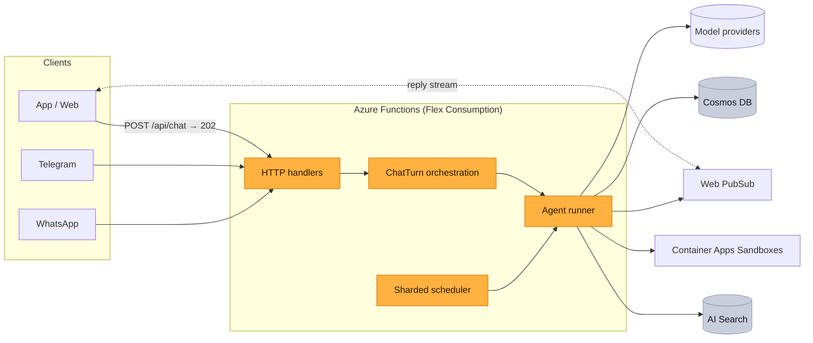

<p align="center">
  <picture>
    <source media="(prefers-color-scheme: dark)" srcset="docs/assets/logo-dark.svg">
    
  </picture>
</p>

<h1 align="center">The open-source brain for personal AI agents.</h1>

<p align="center">
  <b>Muse, Grok and o give every user an AI agent of their own. AgentForEach is the backend to build a product like them.</b><br>
  It runs one agent for each of your users, with memory, scheduled work, tools, a private sandbox and a chat on web, Telegram or WhatsApp,<br>
  on a hyperscale serverless architecture where an idle user costs only storage.
</p>

<p align="center"><code>users.forEach(user =&gt; agent(user))</code></p>

<p align="center">
  <a href="https://github.com/agentforeach/agentforeach/actions/workflows/ci.yml"></a>
  <a href="LICENSE"></a>
  
  
  
</p>

<p align="center">
  <a href="docs/getting-started.md"><b>Get started</b></a> ·
  <a href="docs/Architecture.md">Architecture</a> ·
  <a href="docs/Benchmarks.md">Benchmarks</a> ·
  <a href="docs/README.md">Docs</a> ·
  <a href="ROADMAP.md">Roadmap</a>
</p>

<picture>
  <source media="(prefers-color-scheme: dark)" srcset="docs/assets/hero-dark.svg">
  
</picture>

<p align="center"><sub>Agents sleep in storage and wake per message. You pay for the amber ones.</sub></p>

> **Status: preview.** The architecture is load-tested, the security model reviewed and the code has 1,100+ tests, but it hasn't run in many production deployments yet. Read [SECURITY.md](SECURITY.md) before exposing it to users.

## What it is

A personal AI agent product is much more than a model and a chat window. Behind an app like Muse, every user has an agent that remembers them, keeps working on a schedule while they're away, uses tools, runs code, asks before it acts and answers on whichever channel they use. The company behind it runs all of those agents at once, for every user, without a server for each.

AgentForEach is that backend, open source. You build the product; it runs the agents.

| You build | AgentForEach runs |
|---|---|
| Your app, brand and onboarding | One agent per user: sessions, history, long-term memory, prompt documents |
| Your agent's personality, skills and knowledge | The tool loop, model failover and streaming replies to every device |
| Sign-in, with your identity provider | Reminders, recurring jobs and heartbeats on a sharded scheduler |
| Your pricing and your users | Approvals, per-user sandboxes, Telegram and WhatsApp, tenant isolation, and the whole Azure stack as code |

## Who it's for

- **Startups building a personal-agent product.** Your own Muse for a market, a language or a niche, without building the platform first.
- **Companies with an audience.** Banks, telcos, retailers and schools giving every customer an agent in their app or on WhatsApp.
- **Teams building vertical agents.** A tutor for every student or a coach for every client: your domain, one agent per user.

It also runs in **single-user mode** for one person's own agent ([setup](docs/Identity.md#deployment-scenarios)). That works, but it isn't what the architecture is for: one agent doesn't need hyperscale.

## How it's different

| | Self-hosted personal agents | Agent frameworks | AgentForEach |
|---|---|---|---|
| Built for | One person running their own agent | Developers writing agent logic | Companies running an agent for every user |
| Users per deployment | One owner | Whatever you build | Any number, on one deployment |
| An idle user costs | A machine that stays on | Whatever you build | Storage only |
| Per-user memory, schedules and sandboxes | For the one owner | Build it yourself | Built in and isolated per user |
| Channels and identity linking | The owner's own accounts | Build it yourself | Web and apps, Telegram and WhatsApp, with pairing |
| Infrastructure | A machine or container | Bring your own | One Pulumi program, fully serverless |

## What companies build with it

<table>
  <tr>
    <td width="50%" valign="top">
      <br>
      <b>Your own Muse</b><br>
      A consumer personal-agent app under your brand. Every user's agent remembers them, works while they're away and follows up on its own.
    </td>
    <td width="50%" valign="top">
      <br>
      <b>An agent for every customer</b><br>
      Give each customer of your bank, telco or store their own agent in your app or on WhatsApp, with their history and an approval step before anything that matters.
    </td>
  </tr>
  <tr>
    <td width="50%" valign="top">
      <br>
      <b>A tutor for every student</b><br>
      A vertical agent product: memory of what each student knows, reminders to practise, a sandbox to run their code and your course material as a knowledge base.
    </td>
    <td width="50%" valign="top">
      <br>
      <b>An assistant for every employee</b><br>
      Roll out an agent to everyone in your company, with skills that call your internal APIs. Credentials are injected by the platform and never reach the model.
    </td>
  </tr>
</table>

## Why serverless

The usual way to give each user an agent is one machine or container per user. That is simple at a hundred users and a fleet to run at a million, and you pay for every machine while its user sleeps. AgentForEach runs every user's agent on **one shared serverless platform** instead:

| | One machine (or container) per user | AgentForEach |
|---|---|---|
| Idle user | A VM or container you pay for 24/7 | Storage only |
| 1M users | 1M machines to run, patch and monitor | The same deployment, scaled out |
| Isolation | Per machine | Per tenant in every data path (partition keys, ownership checks), plus per-user sandboxes when code runs |
| Always-on work (reminders, heartbeats) | A process per user | Sharded scheduler (Durable Functions) |

The platform keeps nothing in memory between turns. Every turn loads what it needs (session, history, memories, prompt documents) from Cosmos DB, calls the model and streams the reply over Web PubSub. That is what lets it scale to zero and back out again.

## Measured

<picture>
  <source media="(prefers-color-scheme: dark)" srcset="docs/assets/stats-dark.svg">
  
</picture>

On a fresh stack in Central India. Load-tested at 1,000 users so far; the method and every run's raw results are in [Benchmarks](docs/Benchmarks.md).

- **Platform:** 1,000 users arriving over 3 minutes (≈150 active at a time) sent 3,000 turns with a mock model. All 3,000 completed at 866 turns/min; reply complete in 5.8 s p50 / 12.6 s p95, including 3.2 s of simulated generation.
- **Real model:** 4,799 of 4,800 turns completed with GPT-5.6 Luna (chat, memory, reminders); first text in 4.8 s p50 / 11.1 s p95; ≈ $1.72–2.19 model cost per 1,000 turns.
- **Platform work per turn:** ≈ 0.7 s (session, memory recall, prompt, persistence).
- **Not yet measured:** sandboxes, channels, more than a few hundred users active at once, multi-region.

## What's in the box

<table>
  <tr>
    <td width="33%" valign="top"><br><b>Agent runtime</b><br>Tool loop on OpenAI (Responses API), Azure OpenAI, Anthropic and OpenAI-compatible providers, with failover, streaming, deadlines and per-tool error isolation.</td>
    <td width="33%" valign="top"><br><b>Memory</b><br>Long-term memories with hybrid vector and full-text search, episodes, session digests and compaction.</td>
    <td width="33%" valign="top"><br><b>Scheduled work</b><br>Reminders, recurring jobs and heartbeats on a sharded Durable Functions scheduler.</td>
  </tr>
  <tr>
    <td valign="top"><br><b>Human in the loop</b><br>Forms and approvals that pause a run and resume it later.</td>
    <td valign="top"><br><b>Channels</b><br>Web and apps over Web PubSub, Telegram and WhatsApp, with identity linking and pairing.</td>
    <td valign="top"><br><b>Skills and sandboxes</b><br>Per-user code sandboxes on Azure Container Apps. Credentials are injected at the egress proxy and never enter the sandbox.</td>
  </tr>
  <tr>
    <td valign="top"><br><b>Knowledge</b><br>An optional Azure AI Search index for reference documents.</td>
    <td valign="top"><br><b>Multi-tenant safety</b><br>Tenant-scoped data, SSRF-safe fetching, rate limits, per-session run leases, managed identities, Key Vault secrets and pseudonymised logs.</td>
    <td valign="top"><br><b>Infrastructure as code</b><br>One Pulumi program creates the whole stack.</td>
  </tr>
</table>

## Architecture



A chat message is accepted in the HTTP request (auth, validation, rate limit) and handed to a Durable orchestration, so no turn is bound by the HTTP timeout and an instance recycled mid-turn doesn't lose it. The runner takes a short, renewed lease on the session so a conversation never runs two turns at once, and the reply streams to every device the user has connected.

More: [Architecture](docs/Architecture.md) · [Sessions](docs/Session-management.md) · [Scheduler](docs/Crons.md) · [Human in the loop](docs/HITL.md) · [Identity](docs/Identity.md) · [Channels](docs/Channel.md) · [Sandboxes](docs/Sandbox.md) · [Knowledge](docs/Knowledge.md)

## Quick start

You need Node 22, [Azure Functions Core Tools](https://learn.microsoft.com/azure/azure-functions/functions-run-local) 4, the Azure CLI and [Pulumi](https://www.pulumi.com/docs/install/).

**1. Deploy the stack**

```bash
npm ci && az login
cd infra && pulumi stack init dev
pulumi config set azure-native:location eastus
pulumi config set agentforeach:nameSuffix $(openssl rand -hex 3)
pulumi config set --secret agentforeach:openaiApiKey sk-...
pulumi up && cd ..
./scripts/deploy-gateway.sh dev
```

**2. Let your users sign in.** Choose providers under `auth.providers` in [`gateway/config/agentforeach.json`](gateway/config/agentforeach.json): App Service authentication, JWT, API keys or a trusted proxy. A fresh stack trusts no one, so every API call returns 401 until you do.

**3. Say hi.** Open the [web chat sample](examples/web-chat/) against your Function App URL.

[Getting started](docs/getting-started.md) covers running locally, Azure OpenAI, channels and every setting.

## Documentation

- **Start:** [Getting started](docs/getting-started.md) · [Benchmarks](docs/Benchmarks.md) · [Upgrading](docs/UPGRADING.md)
- **How it works:** [Architecture](docs/Architecture.md) · [Sessions and messages](docs/Session-management.md) · [Identity](docs/Identity.md)
- **Features:** [Scheduler](docs/Crons.md) · [Human in the loop](docs/HITL.md) · [Channels](docs/Channel.md) · [Skills](docs/Skills_Architecture.md) · [Sandboxes](docs/Sandbox.md) · [Knowledge](docs/Knowledge.md)

The full index is in [docs/README.md](docs/README.md).

## Community

- **Questions and ideas:** [GitHub Discussions](https://github.com/agentforeach/agentforeach/discussions)
- **Bugs and deployment problems:** [open an issue](https://github.com/agentforeach/agentforeach/issues/new/choose)
- **Security issues:** report privately, never in public issues; see [SECURITY.md](SECURITY.md)
- **Contributing:** [CONTRIBUTING.md](CONTRIBUTING.md) · **What's next:** [ROADMAP.md](ROADMAP.md)

## License

[Apache-2.0](LICENSE). Third-party notices are in [NOTICE](NOTICE).

Muse, Grok and o are products of Meta, xAI and OpenAI. AgentForEach is an independent project and is not affiliated with them.
