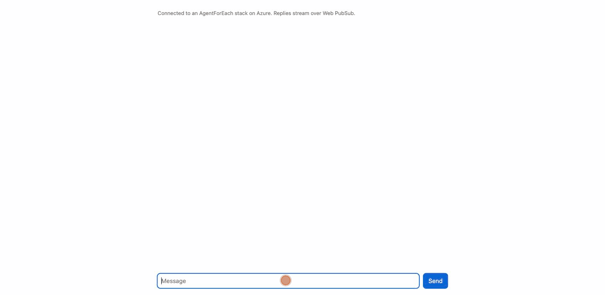
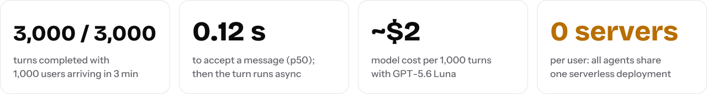
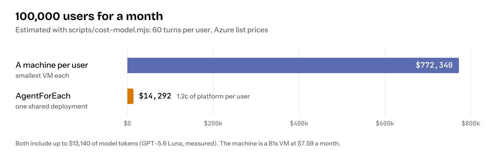

<picture>
  <source media="(prefers-color-scheme: dark)" srcset="docs/assets/banner-dark.svg">
  
</picture>

<p align="center"><code>users.forEach(user =&gt; agent(user))</code></p>

<p align="center"><b>Give every user of your app their own AI agent.</b> It remembers them, works on a schedule while they're away, uses tools, asks before it acts and answers on web, Telegram or WhatsApp. Every agent runs on one serverless deployment: it sleeps in storage and wakes when its user needs it.</p>

<p align="center">
  <a href="https://github.com/agentforeach/agentforeach/actions/workflows/ci.yml"></a>
  <a href="https://github.com/agentforeach/agentforeach/releases"></a>
  <a href="LICENSE"></a>
  
  
</p>

<p align="center">
  <a href="#quick-start"><b>Quick start</b></a> ·
  <a href="#hyperscale-by-design">Why it scales</a> ·
  <a href="docs/Architecture.md">Architecture</a> ·
  <a href="docs/Benchmarks.md">Benchmarks</a> ·
  <a href="docs/costs.md">What it costs</a> ·
  <a href="docs/README.md">Docs</a>
</p>

<p align="center"><sub>Created by <a href="https://github.com/mohit67890">Mohit Garg</a> · <a href="https://x.com/mohitt_garg">@mohitt_garg</a></sub></p>

<p align="center"></p>
<p align="center"><sub>The <a href="examples/web-chat/">web chat sample</a> on a stack deployed with the quickstart: memory, an approval form and a reminder.</sub></p>

## What's new

- **Oct 2, 2026 · Cloudflare as well as Azure.** The gateway now talks to six small cloud-neutral contracts (host, background work, database, files, real-time and sandboxes) instead of Azure's services, and each cloud is a pack checked against shared conformance suites. Azure works as before. Cloudflare runs the same agents on Workers, Durable Objects, PostgreSQL through Hyperdrive, R2 and Containers, with one command to deploy (`./scripts/quickstart-cloudflare.sh`). New and in preview: tested end to end on Cloudflare's local runtime, with sandboxes tested live. AWS and Google Cloud plug in the same way. [Cloudflare](docs/Cloudflare.md) · [Platforms](docs/Platforms.md)
- **Oct 2, 2026 · PostgreSQL as well as Cosmos DB.** Every store now goes through one small storage contract, and two databases pass the same conformance suite. Cosmos DB stays the default; `DATABASE_PROVIDER=postgres` runs the same agents on any PostgreSQL with pgvector: Supabase, Neon, RDS, Azure, or Docker on your laptop. Other databases plug in as adapters. [Database](docs/Database.md)
- **Oct 1 · A real browser for every agent.** The agent opens pages, clicks, types, fills in forms, downloads files and looks at screenshots, in a Chromium that runs inside the user's own sandbox, so it keeps their logins and costs only storage while idle. When a step is the user's to take (a password, a CAPTCHA, a payment), the agent hands them the live browser in the chat and carries on when they press Done. Off by default. [Browser](docs/Browser.md)
- **Sep 30 · One-command quickstart.** Open the repo in Codespaces, run one command, and get a trial stack on Azure with a login for the web chat. [Quick start](#quick-start)
- **Sep 30 · Web chat answers forms and shows reminders**, in the new Tungsten on Night look. [Web chat sample](examples/web-chat/)
- **Sep 30 · A full backend review.** Fixes across the scheduler, billing, sessions, human in the loop and how credentials bind to skills. Every behaviour change is in [UPGRADING.md](docs/UPGRADING.md).
- **Sep 29 · Open source**, Apache-2.0, in preview.

**Next:** local development without an Azure account, a starter app you can rebrand, then AWS and Google Cloud as platform packs. See the [roadmap](ROADMAP.md).

## Hyperscale by design

A personal-agent product, like Muse, Grok or Dots, needs an agent for every user: one that remembers them, works while they're away and runs tools on their behalf. The obvious way to build that is a machine per user. It's simple at a hundred users, a fleet at a million, and billed while every user sleeps.

AgentForEach runs every agent on **one serverless deployment** instead. A turn loads what it needs from Cosmos DB, calls the model, streams the reply and forgets. Nothing in the design is per user or global, so it scales as far as the Azure services underneath it, and an agent that isn't working costs only storage.

<picture>
  <source media="(prefers-color-scheme: dark)" srcset="docs/assets/scale-design-dark.svg">
  
</picture>

Each limit, the setting that raises it and what to change first for a very large deployment are in [Architecture: Scaling](docs/Architecture.md#scaling).

### Measured end to end

<picture>
  <source media="(prefers-color-scheme: dark)" srcset="docs/assets/stats-dark.svg">
  
</picture>

On one fresh deployment, 1,000 users arriving over three minutes completed 3,000 of 3,000 turns, and a message was accepted in about 0.1 s (p50) at every size from 50 to 1,000 users. With a real model, GPT-5.6 Luna, 120 users completed 4,799 of 4,800 turns at about $2 of model cost per 1,000 turns. Method, charts and raw results: [Benchmarks](docs/Benchmarks.md).

## Pay for awake agents, not for users

You pay per turn, and model tokens are most of the bill. **The platform adds about 1–2¢ per user a month, and an idle user costs about $0.0008 a month of storage.**

<picture>
  <source media="(prefers-color-scheme: dark)" srcset="docs/assets/costs-dark.svg">
  
</picture>

The comparison is the smallest VM per user, the way self-hosted personal agents usually run. The estimate for 10,000, 100,000 and 1,000,000 users, every assumption behind it and a script to run with your own numbers are in [What it costs](docs/costs.md).

## You build the product. It runs the brain.

<picture>
  <source media="(prefers-color-scheme: dark)" srcset="docs/assets/stack-dark.svg">
  
</picture>

It's for teams shipping a product where every user gets their own agent:

- **Startups building a personal-agent app.** Your own Muse for a market, a language or a niche, without spending months on the platform first.
- **Product teams adding an agent to an app they already have.** A tutor for every student, a coach for every client, a concierge for every customer.

It runs in your own cloud account, so your users' data never passes through anyone else. Running an agent just for yourself? [Single-user mode](docs/Identity.md#deployment-scenarios) does that.

## Your agent in code

You configure the agent and teach it skills; you don't write the platform.

**Who the agent is.** Every user's agent is built from these documents (excerpt). A change reaches every user; with `"prompt": { "type": "dynamic" }` each user's agent can also update its own copy. What it learns about each user lives in their own profile and memories:

```jsonc
// gateway/config/agentforeach.json
"templates": {
  "IDENTITY": { "name": "Tara", "emoji": "📚", "role": "Study coach", "vibe": "Patient and encouraging" },
  "SOUL": { "coreTruths": ["Find out what the student already knows before explaining anything."] }
}
```

**What it can do.** A skill is a Markdown file. Each user adds their own credentials, which the platform injects so the model never sees them ([Skills](docs/Skills_Architecture.md)):

```markdown
---
id: courses
name: Courses
description: Look up the student's courses, grades and deadlines
category: education
credentials: [{"key":"LMS_TOKEN","label":"Your LMS token","hosts":["lms.example.com"],"header":"Authorization","format":"Bearer {value}"}]
---
Call `https://lms.example.com/api/me/courses` with `Authorization: Bearer $LMS_TOKEN`.
```

**How your app talks to it.** One request per message, as the signed-in user; the reply streams to every device they have open:

```js
await fetch(`${API}/api/chat`, {
  method: "POST",
  headers: { authorization: `Bearer ${token}`, "content-type": "application/json" },
  body: JSON.stringify({ message: "Remind me to revise chapter 3 at 7pm" }),
}); // 202 { runId, sessionId }; the reply arrives over Web PubSub
```

Memory, the reminder at 7pm, the tool loop, approvals and the per-user sandbox come with the platform.

## What companies build with it

<table>
  <tr>
    <td width="50%" valign="top">
      <br>
      <b>Your own Muse</b><br>
      A consumer personal-agent app under your brand. Every user's agent remembers them, works while they're away and follows up on its own.
    </td>
    <td width="50%" valign="top">
      <br>
      <b>An agent for every customer</b><br>
      Give each customer of your bank, telco or store their own agent in your app or on WhatsApp, with their history and an approval step before anything that matters.
    </td>
  </tr>
  <tr>
    <td width="50%" valign="top">
      <br>
      <b>A tutor for every student</b><br>
      A vertical agent product: memory of what each student knows, reminders to practise, a sandbox to run their code and your course material as a knowledge base.
    </td>
    <td width="50%" valign="top">
      <br>
      <b>An assistant for every employee</b><br>
      Roll out an agent to everyone in your company, with skills that call your internal APIs. Credentials are injected by the platform and never reach the model.
    </td>
  </tr>
</table>

## What's in the box

<table>
  <tr>
    <td width="33%" valign="top"><br><b>Agent runtime</b><br>Tool loop on OpenAI (Responses API), Azure OpenAI, Anthropic and OpenAI-compatible providers, with failover, streaming, deadlines and per-tool error isolation.</td>
    <td width="33%" valign="top"><br><b>Memory</b><br>Long-term memories with hybrid vector and full-text search, episodes, session digests and compaction.</td>
    <td width="33%" valign="top"><br><b>Scheduled work</b><br>Reminders, recurring jobs and heartbeats on a sharded Durable Functions scheduler.</td>
  </tr>
  <tr>
    <td valign="top"><br><b>Human in the loop</b><br>Forms and approvals that pause a run and resume it later.</td>
    <td valign="top"><br><b>Channels</b><br>Web and apps over Web PubSub, Telegram and WhatsApp, with identity linking and pairing.</td>
    <td valign="top"><br><b>Skills and sandboxes</b><br>Per-user code sandboxes on Azure Container Apps. Credentials are injected at the egress proxy and never enter the sandbox.</td>
  </tr>
  <tr>
    <td valign="top"><br><b>Knowledge</b><br>An optional Azure AI Search index for reference documents.</td>
    <td valign="top"><br><b>Multi-tenant safety</b><br>Tenant-scoped data, SSRF-safe fetching, rate limits, per-session run leases, managed identities, Key Vault secrets and pseudonymised logs.</td>
    <td valign="top"><br><b>Infrastructure as code</b><br>One Pulumi program creates the whole stack.</td>
  </tr>
  <tr>
    <td colspan="3" valign="top"><br><b>Browser</b> <sub>new</sub><br>A real Chromium in each user's sandbox: the agent reads pages, clicks, types, fills in forms and sees screenshots, and hands the live browser to the user for a login, a CAPTCHA or a payment. Card details never reach the model. Capped per turn and per user, and billable per action.</td>
  </tr>
</table>

## Architecture

<picture>
  <source media="(prefers-color-scheme: dark)" srcset="docs/assets/architecture-dark.svg">
  
</picture>

A message is accepted in the HTTP request (auth, validation, rate limit) and handed to a Durable orchestration, so no turn is bound by the HTTP timeout and an instance recycled mid-turn doesn't lose it. The runner takes a short, renewed lease on the session so a conversation never runs two turns at once, and the reply streams to every device the user has connected.

More: [Architecture](docs/Architecture.md) · [Sessions](docs/Session-management.md) · [Scheduler](docs/Crons.md) · [Human in the loop](docs/HITL.md) · [Identity](docs/Identity.md) · [Channels](docs/Channel.md) · [Sandboxes](docs/Sandbox.md) · [Browser](docs/Browser.md) · [Knowledge](docs/Knowledge.md)

## How it compares

| | A machine per user | An agent framework | AgentForEach |
|---|---|---|---|
| Built for | One person's own agent | Writing agent logic | Running an agent for every user |
| An idle user costs | A machine that stays on | Up to your hosting | Storage only |
| A million users means | A million machines to run | Infrastructure you design | The same deployment, scaled out |
| Memory, schedules and sandboxes per user | For the one owner | You build them | Built in, isolated per tenant |
| Channels and identity linking | The owner's own accounts | You build them | Web, apps, Telegram and WhatsApp, with pairing |

Against Cloudflare Agents, Letta, LangGraph, Mastra and the OpenAI Agents SDK: [How AgentForEach compares](docs/Comparisons.md).

## Quick start

> **Preview.** Load-tested, security-reviewed and covered by 1,200+ tests, but not yet run in many production deployments. Read [SECURITY.md](SECURITY.md) before exposing it to users.

Open the repo in GitHub Codespaces, which has every tool installed, and run one command. It asks for an Azure sign-in (on a subscription where you can assign roles) and an OpenAI API key, deploys a trial stack and prints a login for the [web chat sample](examples/web-chat/).

[](https://codespaces.new/AgentForEach/AgentForEach)

```bash
./scripts/quickstart.sh
```

The trial signs users in with tokens the script makes; `pulumi destroy` removes everything.

On Cloudflare, `./scripts/quickstart-cloudflare.sh` does the same with Wrangler and a PostgreSQL database of your own; see [Cloudflare](docs/Cloudflare.md).

<details>
<summary><b>Deploy step by step, or with real sign-in</b></summary>

You need Node 22, [Azure Functions Core Tools](https://learn.microsoft.com/azure/azure-functions/functions-run-local) 4 (4.15.2 or newer), the Azure CLI, [Pulumi](https://www.pulumi.com/docs/install/), and an Azure subscription where you can assign roles (Owner, or Contributor plus User Access Administrator): the stack grants its own identities access to storage, Key Vault and Cosmos DB.

**1. Create the Azure resources**

```bash
npm ci && az login
cd infra && pulumi stack init dev
pulumi config set azure-native:location eastus
pulumi config set agentforeach:nameSuffix $(openssl rand -hex 3)
pulumi config set --secret agentforeach:openaiApiKey sk-...
pulumi up && cd ..
```

**2. Choose how your users sign in.** Set `auth.providers` in [`gateway/config/agentforeach.json`](gateway/config/agentforeach.json): App Service authentication, JWT, API keys or a trusted proxy. A fresh stack trusts no one, so every API call returns 401 until you do. The web chat sample sends a bearer token, so use JWT to try it ([a test token in two steps](docs/getting-started.md#try-it-with-a-test-token)); API keys suit server-to-server calls.

**3. Deploy the gateway.** The config file ships with the code, so run this again whenever you change it:

```bash
./scripts/deploy-gateway.sh dev
```

**4. Say hi.** Open the [web chat sample](examples/web-chat/) with your Function App URL and a token from the provider you chose.

</details>

[Getting started](docs/getting-started.md) covers running locally, Azure OpenAI, channels and every setting. Questions like "does it include an app?" are answered in the [FAQ](docs/FAQ.md).

## Documentation

- **Start:** [Getting started](docs/getting-started.md) · [What it costs](docs/costs.md) · [Benchmarks](docs/Benchmarks.md) · [FAQ](docs/FAQ.md) · [Upgrading](docs/UPGRADING.md)
- **How it works:** [Architecture](docs/Architecture.md) · [Scaling](docs/Architecture.md#scaling) · [Sessions and messages](docs/Session-management.md) · [Identity](docs/Identity.md) · [Comparisons](docs/Comparisons.md)
- **Features:** [Scheduler](docs/Crons.md) · [Human in the loop](docs/HITL.md) · [Channels](docs/Channel.md) · [Skills](docs/Skills_Architecture.md) · [Sandboxes](docs/Sandbox.md) · [Browser](docs/Browser.md) · [Knowledge](docs/Knowledge.md)

The full index is in [docs/README.md](docs/README.md).

## Community

- **Questions and ideas:** [GitHub Discussions](https://github.com/agentforeach/agentforeach/discussions)
- **Bugs and deployment problems:** [open an issue](https://github.com/agentforeach/agentforeach/issues/new/choose)
- **Security issues:** report privately, never in public issues; see [SECURITY.md](SECURITY.md)
- **Contributing:** [CONTRIBUTING.md](CONTRIBUTING.md) · **What's next:** [ROADMAP.md](ROADMAP.md)

## License

[Apache-2.0](LICENSE). Copyright 2026 Mohit Garg and AgentForEach contributors. Third-party notices are in [NOTICE](NOTICE).

AgentForEach and the AgentForEach logo are trademarks of Mohit Garg. The license covers the code, not the name or logo (Apache-2.0, section 6): a fork or a product built on AgentForEach needs its own name.

Muse, Grok and Dots are products of Meta, xAI and OpenAI. AgentForEach is an independent project and is not affiliated with them.
