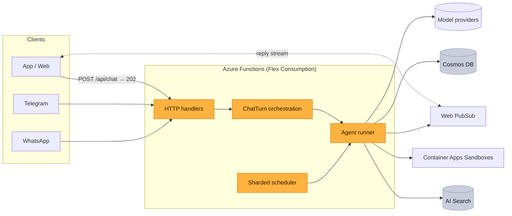

<picture>
  <source media="(prefers-color-scheme: dark)" srcset="docs/assets/banner-dark.svg">
  
</picture>

<p align="center"><code>users.forEach(user =&gt; agent(user))</code></p>

<p align="center"><b>The backend to build a personal-agent product like Muse, Grok or o.</b> Each of your users gets their own agent on serverless Azure, and an idle one costs only storage.</p>

<p align="center">
  <a href="https://github.com/agentforeach/agentforeach/actions/workflows/ci.yml"></a>
  <a href="LICENSE"></a>
  
  
  
</p>

<p align="center">
  <a href="docs/getting-started.md"><b>Get started</b></a> ·
  <a href="docs/Architecture.md">Architecture</a> ·
  <a href="docs/Benchmarks.md">Benchmarks</a> ·
  <a href="docs/README.md">Docs</a> ·
  <a href="ROADMAP.md">Roadmap</a>
</p>

## What it is

A personal AI agent product is much more than a model and a chat window. Behind an app like Muse, every user has an agent that remembers them, works on a schedule while they're away, uses tools, runs code, asks before it acts and answers on whichever channel they use. The company runs all of those agents at once, for every user, without a server for each.

**AgentForEach is that backend, open source. You build the product; it runs the agents.**

<picture>
  <source media="(prefers-color-scheme: dark)" srcset="docs/assets/stack-dark.svg">
  
</picture>

## Who it's for

- **Startups building a personal-agent product.** Your own Muse for a market, a language or a niche, without building the platform first.
- **Companies with an audience.** Banks, telcos, retailers and schools giving every customer an agent in their app or on WhatsApp.
- **Teams building vertical agents.** A tutor for every student or a coach for every client: your domain, one agent per user.

It also runs in **single-user mode** for one person's own agent ([setup](docs/Identity.md#deployment-scenarios)). That works, but it isn't what the architecture is for: one agent doesn't need hyperscale.

## How it's different

<picture>
  <source media="(prefers-color-scheme: dark)" srcset="docs/assets/day-dark.svg">
  
</picture>

The usual way to give each user an agent is a machine or container per user: simple at a hundred users, a fleet to run at a million, and billed while every user sleeps. AgentForEach keeps nothing in memory between turns. Each turn loads what it needs from Cosmos DB, calls the model and streams the reply, so every agent shares **one serverless deployment** that scales to zero and back out.

| | Self-hosted personal agents | Agent frameworks | AgentForEach |
|---|---|---|---|
| Built for | One person running their own agent | Developers writing agent logic | Companies running an agent for every user |
| Users per deployment | One owner | Whatever you build | Any number, on one deployment |
| An idle user costs | A machine that stays on | Whatever you build | Storage only |
| 1M users means | 1M machines to run, patch and monitor | Whatever you build | The same deployment, scaled out |
| Per-user memory, schedules and sandboxes | For the one owner | Build it yourself | Built in, isolated per tenant in every data path |
| Always-on work (reminders, heartbeats) | A process per user | Build it yourself | A sharded scheduler on Durable Functions |
| Channels and identity linking | The owner's own accounts | Build it yourself | Web and apps, Telegram and WhatsApp, with pairing |
| Infrastructure | A machine or container | Bring your own | One Pulumi program, fully serverless |

## Built to scale, and measured

<picture>
  <source media="(prefers-color-scheme: dark)" srcset="docs/assets/stats-dark.svg">
  
</picture>

<picture>
  <source media="(prefers-color-scheme: dark)" srcset="docs/assets/scale-dark.svg">
  
</picture>

- **Real model:** 4,799 of 4,800 turns completed with GPT-5.6 Luna (chat, memory, reminders); first text in 4.8 s p50 / 11.1 s p95; ≈ $1.72–2.19 model cost per 1,000 turns.
- **Platform work per turn:** ≈ 0.7 s (session, memory recall, prompt, persistence). At 1,000 users a reply completed in 5.8 s p50 / 12.6 s p95, including 3.2 s of simulated generation.
- **Not yet measured:** sandboxes, channels, more than a few hundred users active at once, multi-region. Method and raw results: [Benchmarks](docs/Benchmarks.md).

## What it costs

<picture>
  <source media="(prefers-color-scheme: dark)" srcset="docs/assets/costs-dark.svg">
  
</picture>

Model tokens are most of the bill. The platform adds about 1–2¢ per user per month, and an idle user costs about $0.0008 a month of storage. The estimate for 10,000, 100,000 and 1,000,000 users, every assumption behind it and a script to run with your own numbers are in [What it costs](docs/costs.md).

## What companies build with it

<table>
  <tr>
    <td width="50%" valign="top">
      <br>
      <b>Your own Muse</b><br>
      A consumer personal-agent app under your brand. Every user's agent remembers them, works while they're away and follows up on its own.
    </td>
    <td width="50%" valign="top">
      <br>
      <b>An agent for every customer</b><br>
      Give each customer of your bank, telco or store their own agent in your app or on WhatsApp, with their history and an approval step before anything that matters.
    </td>
  </tr>
  <tr>
    <td width="50%" valign="top">
      <br>
      <b>A tutor for every student</b><br>
      A vertical agent product: memory of what each student knows, reminders to practise, a sandbox to run their code and your course material as a knowledge base.
    </td>
    <td width="50%" valign="top">
      <br>
      <b>An assistant for every employee</b><br>
      Roll out an agent to everyone in your company, with skills that call your internal APIs. Credentials are injected by the platform and never reach the model.
    </td>
  </tr>
</table>

## What's in the box

<table>
  <tr>
    <td width="33%" valign="top"><br><b>Agent runtime</b><br>Tool loop on OpenAI (Responses API), Azure OpenAI, Anthropic and OpenAI-compatible providers, with failover, streaming, deadlines and per-tool error isolation.</td>
    <td width="33%" valign="top"><br><b>Memory</b><br>Long-term memories with hybrid vector and full-text search, episodes, session digests and compaction.</td>
    <td width="33%" valign="top"><br><b>Scheduled work</b><br>Reminders, recurring jobs and heartbeats on a sharded Durable Functions scheduler.</td>
  </tr>
  <tr>
    <td valign="top"><br><b>Human in the loop</b><br>Forms and approvals that pause a run and resume it later.</td>
    <td valign="top"><br><b>Channels</b><br>Web and apps over Web PubSub, Telegram and WhatsApp, with identity linking and pairing.</td>
    <td valign="top"><br><b>Skills and sandboxes</b><br>Per-user code sandboxes on Azure Container Apps. Credentials are injected at the egress proxy and never enter the sandbox.</td>
  </tr>
  <tr>
    <td valign="top"><br><b>Knowledge</b><br>An optional Azure AI Search index for reference documents.</td>
    <td valign="top"><br><b>Multi-tenant safety</b><br>Tenant-scoped data, SSRF-safe fetching, rate limits, per-session run leases, managed identities, Key Vault secrets and pseudonymised logs.</td>
    <td valign="top"><br><b>Infrastructure as code</b><br>One Pulumi program creates the whole stack.</td>
  </tr>
</table>

## Architecture



A chat message is accepted in the HTTP request (auth, validation, rate limit) and handed to a Durable orchestration, so no turn is bound by the HTTP timeout and an instance recycled mid-turn doesn't lose it. The runner takes a short, renewed lease on the session so a conversation never runs two turns at once, and the reply streams to every device the user has connected.

More: [Architecture](docs/Architecture.md) · [Sessions](docs/Session-management.md) · [Scheduler](docs/Crons.md) · [Human in the loop](docs/HITL.md) · [Identity](docs/Identity.md) · [Channels](docs/Channel.md) · [Sandboxes](docs/Sandbox.md) · [Knowledge](docs/Knowledge.md)

## Quick start

> **Status: preview.** The architecture is load-tested, the security model reviewed and the code has 1,100+ tests, but it hasn't run in many production deployments yet. Read [SECURITY.md](SECURITY.md) before exposing it to users.

You need Node 22, [Azure Functions Core Tools](https://learn.microsoft.com/azure/azure-functions/functions-run-local) 4, the Azure CLI and [Pulumi](https://www.pulumi.com/docs/install/).

**1. Deploy the stack**

```bash
npm ci && az login
cd infra && pulumi stack init dev
pulumi config set azure-native:location eastus
pulumi config set agentforeach:nameSuffix $(openssl rand -hex 3)
pulumi config set --secret agentforeach:openaiApiKey sk-...
pulumi up && cd ..
./scripts/deploy-gateway.sh dev
```

**2. Let your users sign in.** Choose providers under `auth.providers` in [`gateway/config/agentforeach.json`](gateway/config/agentforeach.json): App Service authentication, JWT, API keys or a trusted proxy. A fresh stack trusts no one, so every API call returns 401 until you do.

**3. Say hi.** Open the [web chat sample](examples/web-chat/) against your Function App URL.

[Getting started](docs/getting-started.md) covers running locally, Azure OpenAI, channels and every setting.

## FAQ

**Is AgentForEach a model?**
No. It runs the agents and calls a model you choose: OpenAI (Responses API), Azure OpenAI, Anthropic or any OpenAI-compatible provider, with failover between them.

**Does it include an app?**
It is the backend. Your app talks to its HTTP API and receives replies over Web PubSub; the [web chat sample](examples/web-chat/) shows the protocol in one HTML file. Telegram and WhatsApp work without an app.

**Which cloud does it run on?**
Azure today: Functions (Flex Consumption), Durable Functions, Cosmos DB, Web PubSub and Container Apps, created by one Pulumi program.

**What does it cost to run?**
Model tokens are most of it. The platform adds a small cost per turn, and an idle user costs only storage. See [What it costs](docs/costs.md) for the estimate at 10,000, 100,000 and 1,000,000 users.

**How are users kept apart?**
Every read and write is scoped to the signed-in user (partition keys and ownership checks), channel identities resolve only through pairing, and code runs in a per-user sandbox. The model and its limits are in [SECURITY.md](SECURITY.md).

**Can I run it just for myself?**
Yes, in [single-user mode](docs/Identity.md#deployment-scenarios). It is built for many users, though.

**Is it ready for production?**
It is in preview: load-tested and security-reviewed, but not yet run in many production deployments.

## Documentation

- **Start:** [Getting started](docs/getting-started.md) · [What it costs](docs/costs.md) · [Benchmarks](docs/Benchmarks.md) · [Upgrading](docs/UPGRADING.md)
- **How it works:** [Architecture](docs/Architecture.md) · [Sessions and messages](docs/Session-management.md) · [Identity](docs/Identity.md)
- **Features:** [Scheduler](docs/Crons.md) · [Human in the loop](docs/HITL.md) · [Channels](docs/Channel.md) · [Skills](docs/Skills_Architecture.md) · [Sandboxes](docs/Sandbox.md) · [Knowledge](docs/Knowledge.md)

The full index is in [docs/README.md](docs/README.md).

## Community

- **Questions and ideas:** [GitHub Discussions](https://github.com/agentforeach/agentforeach/discussions)
- **Bugs and deployment problems:** [open an issue](https://github.com/agentforeach/agentforeach/issues/new/choose)
- **Security issues:** report privately, never in public issues; see [SECURITY.md](SECURITY.md)
- **Contributing:** [CONTRIBUTING.md](CONTRIBUTING.md) · **What's next:** [ROADMAP.md](ROADMAP.md)

## License

[Apache-2.0](LICENSE). Third-party notices are in [NOTICE](NOTICE).

Muse, Grok and o are products of Meta, xAI and OpenAI. AgentForEach is an independent project and is not affiliated with them.
