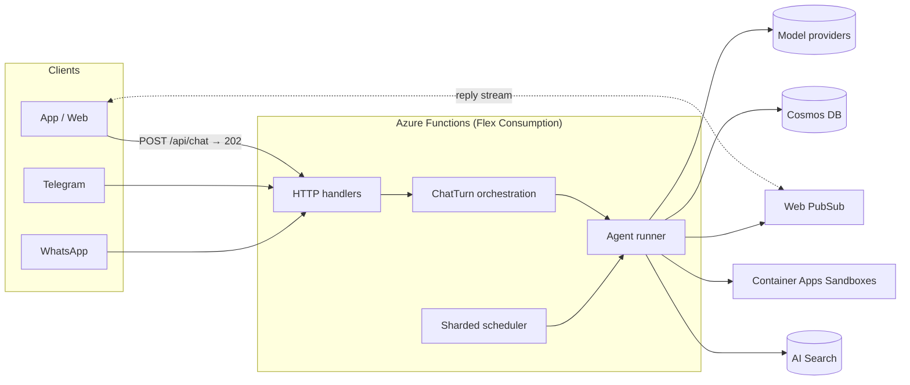

# AgentForEach

**Run personal AI agents for millions of users. Serverless, pay per use, open source.**

AgentForEach is the backend for a personal AI agent product: each user gets an assistant with its own memory, conversations, scheduled tasks, tools and (optionally) a private code sandbox, reachable from an app, the web, Telegram or WhatsApp. It runs entirely on serverless Azure services, so a user who isn't talking to their agent costs nothing but storage, and a user who is costs a few model tokens and milliseconds of compute.

> **Status: preview.** The architecture has been load-tested (below), the security model reviewed, and the code has 1,000+ tests, but it hasn't run in many production deployments yet. Expect rough edges and read [SECURITY.md](SECURITY.md) before exposing it to users.

## Why this design

Personal agents are usually built one of two ways:

| | One machine (or container) per user | AgentForEach: one shared serverless platform |
|---|---|---|
| Idle user | A VM or container you pay for 24/7 | Storage only |
| 1M users | 1M machines to run, patch and monitor | The same deployment, scaled out |
| Isolation | Per machine | Per tenant in every data path (partition keys, ownership checks), plus per-user sandboxes when code runs |
| Always-on work (reminders, heartbeats) | A process per user | Sharded scheduler (Durable Functions) |

The platform keeps nothing in memory between turns: every turn loads what it needs (session, history, memories, prompt documents) from Cosmos DB, calls the model, and streams the reply over Web PubSub. That is what lets it scale to zero and out again.

## Measured

On a fresh stack in Central India ([full results and method](docs/Benchmarks.md)):

| | Result |
|---|---|
| 1,000 users arriving over 3 minutes (≈150 active at a time), 3,000 turns (mock model, to measure the platform) | **3,000 / 3,000 completed**, 866 turns/min, request accepted in 0.12 s (p50), reply complete 5.8 s p50 / 12.6 s p95 incl. 3.2 s of simulated generation |
| GPT-5.6 Luna, 4,800 turns (chat, memory, reminders) | **4,799 / 4,800 completed**, first text 4.8 s p50 / 11.1 s p95 |
| Model cost | **≈ $1.72–2.19 per 1,000 turns** with GPT-5.6 Luna |
| Platform work per turn | ≈ 0.7 s (session, memory recall, prompt, persistence) |

Not yet measured: sandboxes, channels, more than a few hundred users active at once, multi-region.

## What's in the box

- **Agent runtime** — tool loop with OpenAI (Responses API), Azure OpenAI, Anthropic and OpenAI-compatible providers, failover, streaming, deadlines, per-tool error isolation.
- **Memory** — long-term memories with hybrid (vector + full-text) search, episodes, session digests, compaction.
- **Scheduled work** — reminders, recurring jobs and heartbeats on a sharded Durable Functions scheduler.
- **Human in the loop** — forms and approvals that pause a run and resume it later.
- **Channels** — web/app over Web PubSub, Telegram, WhatsApp, with identity linking and pairing.
- **Skills and sandboxes** — per-user code sandboxes on Azure Container Apps Sandboxes, with credentials injected at the egress proxy so they never enter the sandbox.
- **Knowledge** — optional Azure AI Search index for reference documents.
- **Multi-tenant safety** — tenant-scoped data model, SSRF-safe fetching, rate limits, per-session run leases, managed identities instead of keys, secrets in Key Vault, pseudonymised logs.
- **Infrastructure as code** — one Pulumi program creates everything.

## Architecture



A chat message is accepted in the HTTP request (auth, validation, rate limit) and handed to a Durable orchestration, so no turn is bound by the HTTP timeout and an instance recycled mid-turn doesn't lose it. The runner takes a short, renewed lease on the session so a conversation never runs two turns at once, and the reply streams to every device the user has connected.

Details: [Architecture](docs/Architecture.md) · [Session management](docs/Session-management.md) · [Crons](docs/Crons.md) · [HITL](docs/HITL.md) · [Identity](docs/Identity.md) · [Channels](docs/Channel.md) · [Sandboxes](docs/Sandbox.md) · [Knowledge](docs/Knowledge.md) · [Real-time protocol](docs/Architecture.md#real-time-protocol) · [Upgrading](docs/UPGRADING.md)

## Quick start

Prerequisites: Node 22, [Azure Functions Core Tools](https://learn.microsoft.com/azure/azure-functions/functions-run-local) 4, the Azure CLI, and [Pulumi](https://www.pulumi.com/docs/install/).

### Deploy to Azure

```bash
npm ci
az login
cd infra
pulumi stack init dev
pulumi config set azure-native:location eastus
pulumi config set agentforeach:nameSuffix $(openssl rand -hex 3)   # makes the global resource names yours
pulumi config set --secret agentforeach:openaiApiKey sk-...     # or an Azure OpenAI key; see below
pulumi up                                                 # see Pulumi.example.yaml for every setting
cd ../..
./scripts/deploy-gateway.sh dev
```

To use Azure OpenAI (Foundry) instead of OpenAI, set `llms.providers.openai.baseUrl` in `gateway/config/agentforeach.json` to `https://<resource>.openai.azure.com/openai/v1/`, and use the deployment name as the model name.

Then configure how users sign in: `auth.providers` in `agentforeach.json` (App Service authentication, JWT, API keys or a trusted proxy). **Until you do, every API call returns 401**; a fresh stack trusts no one. Channels ([Telegram and WhatsApp](docs/Channel.md)) are off until configured too.

### Run locally

Durable Functions needs a storage emulator, and the runtime needs a Cosmos DB account (the Cosmos emulator lacks vector search). A serverless account costs nothing while idle:

```bash
docker run -d -p 10000-10002:10000-10002 mcr.microsoft.com/azure-storage/azurite   # or: npx azurite
az cosmosdb create -g <rg> -n <account> --capabilities EnableServerless EnableNoSQLVectorSearch

npm ci
cp gateway/local.settings.example.json gateway/local.settings.json
# set COSMOS_ENDPOINT and COSMOS_KEY (az cosmosdb keys list -g <rg> -n <account>),
# OPENAI_API_KEY, and AUTH_ALLOW_INSECURE_USER_ID_HEADER=true
cd gateway
npm start                                   # builds, then starts the Functions host on :7071
curl -X POST localhost:7071/api/chat -H 'x-user-id: me' -H 'content-type: application/json' -d '{"message":"hi"}'
```

Locally, turns run inside the HTTP request, containers are created on first use, and `x-user-id` identifies the user (never honoured on Azure).

To chat from a browser, open the [web chat sample](examples/web-chat/) against either gateway.

### Tests

```bash
npm test --workspace @agentforeach/gateway          # unit and integration tests
# load test against a deployed stack: see docs/Benchmarks.md
```

## Configuration

Runtime behaviour lives in [`gateway/config/agentforeach.json`](gateway/config/agentforeach.json) (models, memory, prompts, channels, rate limits, cron, sandboxes); secrets come from app settings, which the Pulumi program stores in Key Vault. Infrastructure settings are in [`infra/Pulumi.example.yaml`](infra/Pulumi.example.yaml).

## Contributing and security

See [CONTRIBUTING.md](CONTRIBUTING.md) and [SECURITY.md](SECURITY.md). Report vulnerabilities privately, not in issues.

## License

[Apache-2.0](LICENSE). Parts of the prompt and memory design are adapted from [OpenClaw](https://github.com/openclaw/openclaw) (MIT); see [NOTICE](NOTICE).
