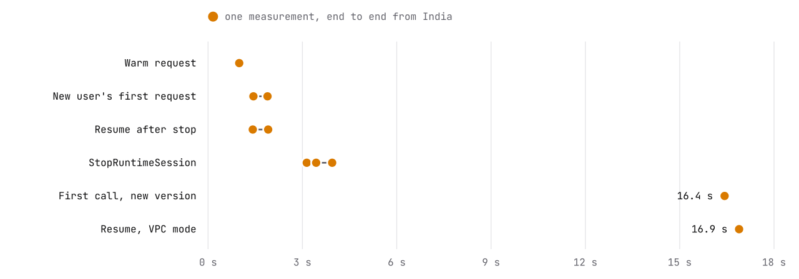
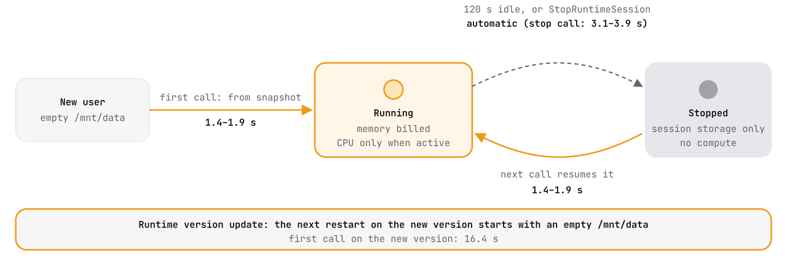

# AgentForEach sandboxes on AWS Bedrock AgentCore Runtime

> **Status (October 2026):** Tested on 2 October 2026 in `us-west-2`, with AgentCore Runtime session storage in preview. Nothing here changes AgentForEach's default backend, which is still ACA Sandboxes ([Sandbox.md](Sandbox.md)). The other platforms we tested the same week are in [GCP_Evaluation.md](GCP_Evaluation.md) and [Cloudflare_Evaluation.md](Cloudflare_Evaluation.md).

We ran AgentForEach's sandbox image on Amazon Bedrock AgentCore Runtime, one session per user, and measured what our agents need: start, stop, resume, persistence and egress control.

## Summary

| New user's sandbox | Resume after stop | Idle stop and resume | Runtime update |
|---|---|---|---|
| **1.4 to 1.9 s** to the first answer, end to end from India | **1.4 to 1.9 s**, automatic on the next call | **Built in**: stopped after 120 s idle, resumed on the next call with nothing for us to build | **Wiped session storage**: the next restart on the new version started with an empty `/mnt/data` |

**What worked.**
- Our image ran with a 43-line adapter for AgentCore's health and invoke contract; `server.mjs` was unchanged.
- Every user got their own Firecracker microVM, ready in under 2 s because each session is restored from a prepared snapshot.
- Idle stop and resume on the next call are automatic, the only platform besides ACA Sandboxes where we built neither direction.
- Session storage kept files across stop and resume.

**What stops us using it.**
- Updating the runtime, which happens on every image rebuild or config change, resets every user's session storage on their next restart.
- Session storage is also capped at 1 GB and deleted after 14 days without use.
- Egress is fully open in PUBLIC mode. VPC mode can deny everything, but only after you build PrivateLink endpoints for AgentCore to start at all, and public DNS still resolves.
- There is no built-in host allowlist or credential injection.

## What AgentForEach needs from a sandbox

The same list we used for every platform ([Sandbox-Migration.md](Sandbox-Migration.md#what-agentforeach-needs-from-a-sandbox)):

- **A VM-grade boundary** per user, because the code is written by a model and the skills by users.
- **One sandbox per user that keeps its files** across idle periods of hours or days.
- **Zero compute cost while idle**, since most users are asleep at any moment.
- **Egress denied by default**, with per-host allow rules.
- **Credentials injected at the proxy**, so a secret never enters the sandbox.

## What we built

- **Image.** Our `gateway/sandbox-container/Dockerfile`, unchanged, built for `linux/arm64` (AgentCore runs on Graviton). It built natively on an Apple Silicon Mac in 56 s and is 0.50 GB, under AgentCore's 2 GB limit.
- **Adapter.** AgentCore's HTTP protocol wants `GET /ping` and `POST /invocations` on port 8080. A small Node adapter answers `/ping` and forwards `{method, path, body}` from `/invocations` to `server.mjs`, which moves to port 8081. Each reply also carries the microVM's boot id and uptime, so we could tell sessions apart.
- **Runtime.** HTTP protocol; session storage mounted at `/mnt/data`, our server's own work directory (`/mnt/<name>` is allowed); idle timeout 120 s (the minimum is 60 s, the default 900 s); maximum lifetime 1 hour. An execution role that can only pull this one image and write its own logs, trusted only by AgentCore runtimes in our account and region.
- **Client.** boto3 calling `InvokeAgentRuntime`, `InvokeAgentRuntimeCommand` and `StopRuntimeSession`, with each user's session id derived from a hash of the user id (AgentCore requires at least 33 characters and does not map users to sessions itself).

<picture>
  <source media="(prefers-color-scheme: dark)" srcset="assets/aws-architecture-dark.svg">
  
</picture>

The runtime was ready 12 s after `create-agent-runtime` in PUBLIC mode, and AgentCore created its `DEFAULT` endpoint on its own.

## What we measured

All timings are end to end from a client in India to `us-west-2`, so each includes that round trip. Inside the sandbox our handler took 3 to 5 ms.

<picture>
  <source media="(prefers-color-scheme: dark)" srcset="assets/aws-timings-dark.svg">
  
</picture>

| Check | Result |
|---|---|
| Isolation | One Firecracker microVM per session; kernel `6.1.161-18.298.amzn2023.aarch64`; root inside; 2 vCPU and 8 GB, the per-session maximum |
| Our server through the adapter | ✅ `/exec`, `/files/write`, `/files/read`, `/env` all worked |
| A 30 s command | ✅ 31.0 s through our server, and 31.0 s through `InvokeAgentRuntimeCommand` with its first output event at 0.9 s |
| `InvokeAgentRuntimeCommand` | ✅ works, but does not use a shell: `sleep 30; echo done` exits 1, `/bin/bash -c "sleep 30; echo done"` works. It sees the same files as the server |
| Files in `/mnt/data` after stop and resume | ✅ kept |
| Files elsewhere, memory, processes after stop and resume | ❌ lost: a file in `/root`, an env var held by the server and a background loop were all gone. This matches ACA Sandboxes in `Disk` mode |
| Idle stop | ✅ after 120 s without a call, a file in `/tmp` was gone (new microVM) and a file in `/mnt/data` was kept |
| Resume | ✅ automatic on the next call, 1.4 to 1.9 s |
| Session storage | A 1 GB network filesystem (`127.0.0.1:/export`) at `/mnt/data` |

### Every session starts from the same snapshot

A brand-new session answered its first request in 1.4 to 1.9 s, yet our adapter reported it had been running for 82 s. Three different users' sessions shared one kernel boot id, and the adapter's uptime counted continuously across all of them. AgentCore restores every session from one microVM snapshot taken when the runtime version is prepared.

- `/dev/urandom` and newly started processes gave different random values in every session, so the kernel reseeds after a restore.
- Anything a long-running process generated before the snapshot is identical in every user's sandbox. This is the same caveat AWS gives for Lambda SnapStart: create secrets, keys and ids per session, never at container start-up.

<picture>
  <source media="(prefers-color-scheme: dark)" srcset="assets/aws-lifecycle-dark.svg">
  
</picture>

### A runtime update resets session storage

We made the smallest possible update: the same image digest with one added, non-secret environment variable. That created runtime version 2, and the `DEFAULT` endpoint moved to it within a second.

- A session that was already running stayed on version 1, with its files, until it stopped.
- After `StopRuntimeSession`, the next call came back on version 2 with an empty `/mnt/data`. Our test file and the background job's log were gone. That first call took 16.4 s.
- The AWS documentation states this behaviour: session storage is "deleted (reset to a clean state)" when "the agent runtime version is updated".

For AgentForEach this rules session storage out as the home for user files. Every image rebuild (ours is weekly, for OS and runtime updates) and every config change would erase every user's workspace the next time their session restarts.

## Egress

### PUBLIC mode

The same probes we ran on the other platforms, from inside a session:

| Probe | Result |
|---|---|
| HTTPS (`pypi.org`) and HTTP (`example.com`) | open |
| WebSocket upgrade | open (`101`) |
| Raw TCP (`github.com:22`) | open: the SSH banner came back |
| `pip download` | works |
| UDP DNS to `8.8.8.8` | blocked; names resolve through a local resolver at `127.0.0.2` |

There is no allowlist and no credential injection in PUBLIC mode.

### VPC mode with no internet route

To test deny-by-default, we put a second runtime in a VPC with two private subnets in supported Availability Zones, **no NAT gateway**, an S3 gateway endpoint, and a security group whose only outbound rule allowed HTTPS to S3.

- **It could not start.** Every call failed with `Runtime initialization time exceeded … 120s` and then a failed health check. AgentCore's VPC guide says a VPC without internet access needs interface endpoints for `ecr.api`, `ecr.dkr` and `logs`, plus the S3 gateway endpoint.
- With those three interface endpoints added (security group: HTTPS from the runtime only), the runtime started. The first call on a new session still failed its health check once; later calls worked.
- **Outbound traffic was blocked**: HTTPS, HTTP, WebSockets, raw TCP and UDP DNS to `8.8.8.8` all timed out.
- **Public DNS still resolved** through the VPC resolver (`example.com` returned an address), so DNS remains a channel out unless you add Route 53 Resolver DNS Firewall.
- **Session storage worked** through the S3 gateway endpoint, but resume after a stop took 16.9 s, against 1.4 to 1.9 s in PUBLIC mode.
- The VPC-mode runtime took 272 s to become ready, against 12 s in PUBLIC mode.

A host allowlist needs a NAT gateway plus AWS Network Firewall or a proxy you run, and credential injection needs a proxy you run. Neither is part of AgentCore Runtime.

## What we would ask the AgentCore team

1. **Session storage that survives runtime updates**, or an option to keep it. Without it, session storage cannot hold a user's workspace for any product that ships image updates.
2. **Higher session storage limits** than 1 GB and 14 days idle, or a documented way to bring per-session storage of our own without a shared file system.
3. **A runtime that starts in a VPC with no endpoints of ours**, or a clear failure message naming the missing endpoints, instead of an initialization timeout.
4. **Egress policy as a runtime setting**: deny by default, host allowlists and header injection, as on Cloudflare Containers and Azure Container Apps Sandboxes.
5. **`InvokeAgentRuntimeCommand` with an option to run through a shell**, or documentation that it does not.
6. **Guidance on per-session state after snapshot restore**, as for Lambda SnapStart, since every session shares one pre-initialised memory image.

## Against the other sandboxes we tested this week

| Need | ACA Sandboxes (today) | GKE Agent Substrate | GKE Agent Sandbox | Cloudflare Containers | AWS AgentCore Runtime |
|---|---|---|---|---|---|
| Boundary | microVM | gVisor | gVisor | Firecracker microVM | Firecracker microVM |
| New sandbox | 0.7 to 0.8 s to create ([measured](Sandbox-Migration.md)) | 1.3 s from the template snapshot | about 4 s from a warm pool | 2.5 to 4.1 s when it works | 1.4 to 1.9 s |
| Idle stop | ✅ built in | ❌ | ❌ | ◐ our alarm, about 20 lines | ✅ built in |
| Resume on request | ✅ our client calls resume | ✅ | ❌ | ✅ | ✅ |
| Kept across stop | disk | disk, memory, processes | disk, memory, processes; snapshots not scoped per user | disk | session storage (1 GB), wiped on version update |
| Egress denied by default | ✅ | ❌ | ◐ internal ranges only | ✅ | ◐ VPC mode with PrivateLink endpoints; DNS still resolves |
| Credentials outside the sandbox | ✅ | ◐ experimental | ❌ | ✅ | ❌ build your own proxy |
| Infrastructure to run | none | GKE cluster | GKE Autopilot cluster | none | none (PUBLIC); a VPC with endpoints (deny-by-default) |
| **Blocking issue** | none | egress, maturity | snapshot scoping, lifecycle | start reliability | **storage wiped on update**, egress |

## Cost

- **Expected usage cost:** a few cents of compute for about two hours of testing (to be confirmed from the bill). AgentCore bills CPU only while a session is active ($0.0895 per vCPU-hour) and memory while it runs ($0.00945 per GB-hour), which is why we cut the idle timeout to 120 s.
- **VPC mode adds fixed costs:** each interface endpoint is about $0.01 per hour per Availability Zone, so the three we needed cost about $0.06 per hour while they existed. A NAT gateway for internet access would add about $0.045 per hour plus data.
- We could not find a published price for session storage while it is in preview.

## How we tested, and what we did not

- **Account:** a dedicated IAM user with `aws login` short-term credentials (not the root user), a $10 budget alert, region `us-west-2`, all on 2 October 2026.
- **Client:** one laptop in India, boto3 1.43 with the CRT extra (needed for `aws login` credentials).
- **Samples:** small. 10 warm requests, 3 new sessions, 2 resumes, 3 stops, 1 version update. Treat the timings as indicative.
- **Not tested:** Chromium in a session, sessions longer than an hour, the 1 GB storage limit, the Instances compute type (EC2-backed, with EBS volumes that do survive updates), and burst scale.
- **Not probed:** the instance metadata service and internal addresses, as on the other platforms.

## Cleanup

Everything was deleted the same day: both runtimes (which deletes their session storage), the ECR repository, the execution role, the log groups and all four VPC endpoints. The security group, subnets and VPC are free and can only be deleted once AgentCore releases its network interfaces, which takes up to 8 hours after the runtimes are deleted.
