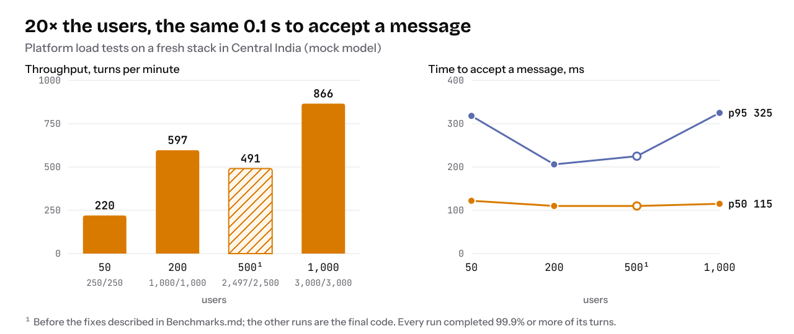

# Benchmarks

What a deployment of this repo does under load, measured on a fresh stack with `scripts/load-test/run.mjs`. Every number the README quotes comes from here.

> **First run:** 29 September 2026, Central India. Summaries of every run are in [`docs/benchmarks/`](benchmarks/).

<picture>
  <source media="(prefers-color-scheme: dark)" srcset="assets/scale-dark.svg">
  
</picture>

## Method

Each simulated user has its own identity (an HS256 JWT), its own Web PubSub socket (negotiated like the app does) and its own chat session. A user sends a turn, waits for the reply, thinks for a few seconds, and sends the next. Users start evenly over the ramp period.

A turn goes through the production path: `POST /api/chat` returns `202`, the turn runs in a `ChatTurn` orchestration, and the reply streams back over Web PubSub. Per turn the script records:

| Metric | Meaning |
|---|---|
| `acceptMs` | `POST /api/chat` until the `202` |
| `firstTextMs` | `POST` until the first streamed text |
| `totalMs` | `POST` until the `final` event |
| outcome | `completed`, an error code (`rate_limited`, `session_busy`, `timeout`, …) |
| tokens | input/output tokens from the `final` event |

The message mix is configurable (`--mix chat=80,memory=15,cron=5,sandbox=0`): plain questions, memory writes and reads, reminders (cron jobs), and optionally sandboxed code.

## Running it

1. Deploy a scratch stack (never a real one: the load-test config accepts self-signed tokens).

   ```bash
   node scripts/load-test/make-config.mjs         # writes gateway/config/agentforeach.loadtest.json (gitignored)
   export LOADTEST_JWT_SECRET=$(openssl rand -hex 32)
   cd infra
   pulumi stack init loadtest
   pulumi config set azure-native:location centralindia
   pulumi config set agentforeach:nameSuffix $(openssl rand -hex 3)
   pulumi config set --secret agentforeach:openaiApiKey sk-...
   pulumi config set --secret --path 'agentforeach:extraAppSettings.CONFIG_FILE_JSON' agentforeach.loadtest.json
   pulumi config set --secret --path 'agentforeach:extraAppSettings.LOADTEST_JWT_SECRET' "$LOADTEST_JWT_SECRET"
   pulumi up
   ```

   Then deploy the app package (`scripts/deploy-gateway.sh`).

2. Run the test:

   ```bash
   node scripts/load-test/run.mjs \
     --base-url https://<app>.azurewebsites.net \
     --users 200 --turns 5 --ramp-seconds 120 --think-ms 5000 \
     --mix chat=80,memory=15,cron=5 --out docs/benchmarks/run-1.json
   ```

3. Read the cost for the run window from Cost Management (group by resource) and divide by completed turns.

4. `pulumi destroy`, then `az keyvault purge` for the vault if you want the name back.

## Environment

A fresh stack from this repo (`Pulumi.example.yaml` defaults unless noted):

| Component | Setting |
|---|---|
| Azure Functions | Flex Consumption, Node 22, 2 GB instances, up to 100 instances, no always-ready instances |
| Durable Functions | Azure Storage backend, 16 partitions |
| Cosmos DB | Serverless, managed-identity access |
| Web PubSub | Standard S1, **2 units** (2,000 connections) |
| Region | Central India; load generated from one laptop in India |
| Model (platform runs) | `scripts/load-test/mock-llm.mjs` on Azure Container Apps: 0.8 s to first token, then 60 words at 40 ms (≈3.2 s per reply) |
| Model (real run) | GPT-5.6 Luna on Azure OpenAI in Foundry (East US 2, 5M tokens/min), default reasoning effort; embeddings `text-embedding-3-small` |

## Results

### Platform: how the infrastructure scales (mock model)

Each user: 3–5 turns, 3 s think time. Times are seconds from `POST /api/chat` to the event; subtract ≈3.2 s of mock generation from "final" to get the platform's own share.

| Users | Turns | Completed | Throughput (turns/min) | Accept p50 | First text p50 / p95 | Final p50 / p95 / p99 | Slowest |
|---|---|---|---|---|---|---|---|
| 50 | 250 | 250 | 220 | 0.12 | 2.1 / 3.6 | 4.3 / 5.7 / 6.2 | 6.3 |
| 200 | 1,000 | 1,000 | 597 | 0.11 | 2.9 / 5.8 | 5.1 / 8.0 / 9.1 | 15.5 |
| 500 ¹ | 2,500 | 2,497 | 491 | 0.11 | 2.5 / 12.5 | 4.7 / 14.7 / 17.6 | 24.8 |
| **1,000** | **3,000** | **3,000** | **866** | **0.12** | **3.7 / 10.3** | **5.8 / 12.6 / 15.8** | **19.5** |

¹ Before the fixes below; the 1,000-user row is the final code.

Where the time goes at 1,000 users: the turn's own work (session, history, memory, prompt, persistence) was 3.9 s p50 / 4.9 s p95 **including** the 3.2 s mock reply, so ≈0.7 s of platform work per turn. The rest of the tail is Durable Functions handing the turn from the HTTP request to a worker while the app scales out (1.7 s p50, 9.3 s p95), across 7 instances at peak.

### What the load test found (and fixed)

Four runs at 1,000 users, each fixing what the previous one exposed:

| Run | Completed | Lost | Final p95 | Cause found | Fix |
|---|---|---|---|---|---|
| 1 | 2,978 | 22 | 12.8 s | Flex scale-in killed Node workers mid-turn; Durable redelivered only after 5 min, and the session lease blocked the redelivery for ~9.5 min more | 60 s leases renewed every 20 s; 1-min work-item visibility; Node 22 |
| 2 | 2,996 | 4 | 9.2 s | A redelivered turn found its own dead run holding the session and stood down | Wait for the holder to finish (replay its reply) or its lease to lapse (take over) |
| 3 | 2,984 | 16 | 13.7 s | Durable control-queue messages stayed invisible 5 min when partitions moved between instances (turns started ~300 s late) | 1-min control-queue visibility; table-based partition management |
| **4** | **3,000** | **0** | **12.6 s** | None | None |

### Real model: GPT-5.6 Luna

120 users × 40 turns, 10 s think time, mix 80% chat / 15% memory (store, recall) / 5% reminders (cron jobs), kept to ~70% of the deployment's token limit.

| Turns | Completed | Throughput | Accept p50 | First text p50 / p95 | Final p50 / p95 / p99 |
|---|---|---|---|---|---|
| 4,800 | 4,799 (99.98%) | 359/min | 0.11 s | 4.8 / 11.1 s | 5.4 / 11.8 / 18.6 s |

By scenario (final p50 / p95): chat 5.1 / 9.0 s, memory 8.9 / 17.6 s, reminders 7.2 / 13.6 s (tool turns take a second model round). The one failure was the model stream dropping mid-reply ("Premature close").

**Model cost:** 55.7M input tokens (11.6k per turn, 11% served from cache) and 0.42M output → **$10.49, or $2.19 per 1,000 turns** at Luna list prices.

**Azure cost** for the whole day's testing (≈18,000 turns, stack up ~2 hours) is estimated at $5–10, most of it the fixed daily Web PubSub charge (infrastructure only; model cost is above).

## Limits and next steps

- **Tail latency is Durable dispatch.** Options, by effort: one or two always-ready instances (fixed cost); the managed Durable Task Scheduler backend; a single queue hop for chat turns (slower recovery from killed instances).
- **Prompt caching (11% of input tokens).** Investigated after the run. The system prompt is now ordered static → per user → per turn, so every request starts with the same ~6k tokens of tool definitions and static instructions (verified with the `fp_tools` / `fp_instr4k` fingerprints now logged per model call). Requests also carry a pseudonymous per-user `prompt_cache_key`. On the Azure GlobalStandard deployment used here this did **not** raise the hit rate (8–15% in 200-turn checks): the cache is reused only between the two model calls of a tool turn, never across turns, with or without `previous_response_id` chaining (`llms.chainResponses`). That points at how GlobalStandard spreads requests over its backends, not at the prompt. Still to measure: OpenAI's own API and a regional or provisioned Azure deployment. Model cost in these checks: $1.72–1.77 per 1,000 turns.
- **Dropped model streams.** A stream that drops before any output is now retried once (`llms/stream-retry.ts`); one that drops mid-reply, like the single failure in the Luna run, still fails the turn.
- Not yet measured: sandboxes, channels (Telegram/WhatsApp), more than a few hundred users active at once (the 1,000-user runs had ≈150 connected at a time: users arrive over 3 minutes and disconnect after their turns), multi-region.
