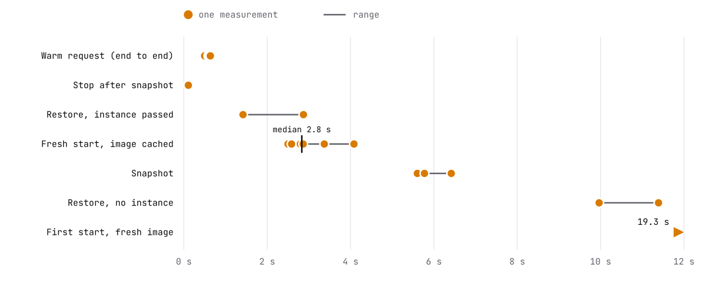
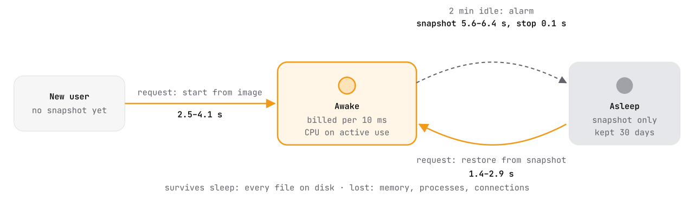
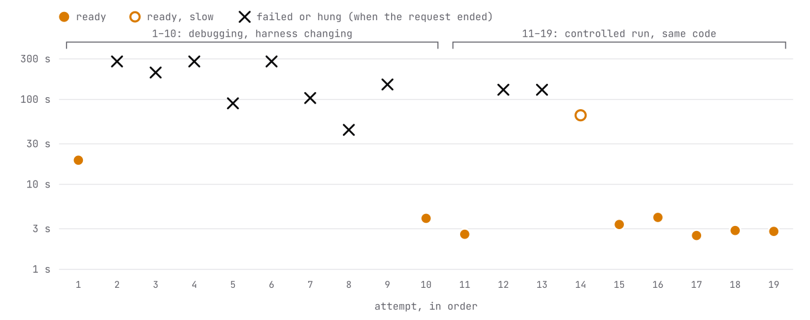

# AgentForEach sandboxes on Cloudflare Containers

> **Status (October 2026):** Tested on 1 October 2026 with Containers' `durable_object` scheduling policy and Snapshots, both in public beta. Nothing here changes AgentForEach's default backend, which is still ACA Sandboxes ([Sandbox.md](Sandbox.md)). The Google Cloud options we tested the same week are in [GCP_Evaluation.md](GCP_Evaluation.md).

We ran AgentForEach's unchanged sandbox image on Cloudflare Containers, one Durable Object per user. We measured what our agents need: start, suspend, restore and egress control.

## Summary

| Fresh start | Restore | Snapshot size | Controlled run |
|---|---|---|---|
| **2.8 s** median, image cached (6 starts, 2.5 to 4.1 s), including our own start command | **1.4 to 2.9 s** from a disk snapshot to a working sandbox, end to end | **0.45 to 0.8 MB**, because snapshots store only the changes from the image; taking one took 5.6 to 6.4 s | **7 of 9** fresh starts became ready; two hung past 130 s and one took 65 s |

**What worked.**
- Our container ran without changes in a Firecracker microVM.
- A Durable Object per user gave us start on request, suspend after 2 minutes idle, and restore from snapshot, in about 20 lines of our own code.
- The egress model matched our production policy on Azure: deny by default, allow named hosts, and inject credentials outside the sandbox. DNS could not be used to send data out.

**What stops us shipping it.**
- Fresh starts were not reliable. In a controlled run of nine, two hung past 130 s and one took 65 s. While we were debugging earlier, most attempts failed, including one that ended with `Network connection lost`.
- A restore without an instance size came back quietly as a 458 MiB machine.

Both are covered under [Feedback for the Containers team](#feedback-for-the-containers-team).

## What AgentForEach needs from a sandbox

AgentForEach is an open-source brain for personal AI agents: one agent for every user of an app, on one serverless deployment. The brain never runs model-written code itself. It calls a private sandbox per user over HTTP to run commands, read and write files, and drive a browser. Today that sandbox is Azure Container Apps Sandboxes. An alternative has to keep five properties:

- **A VM-grade boundary** per user, because the code is written by a model and the skills by users.
- **One sandbox per user that keeps its files** across idle periods of hours or days.
- **Zero compute cost while idle**, since most users are asleep at any moment.
- **Egress denied by default**, with per-host allow rules.
- **Credentials injected at the proxy**, so a secret never enters the sandbox.

## The test harness

The harness is one Worker, one Durable Object class and our existing image:
- **The Worker** checks a bearer token and routes `/u/<user>/…` to `getByName(user)`.
- **The Durable Object** starts that user's container on demand, restoring its last snapshot. It forwards the request to our sandbox server on port 8080, and arms an alarm that snapshots and stops the container after 2 minutes idle.

<picture>
  <source media="(prefers-color-scheme: dark)" srcset="assets/cloudflare-architecture-dark.svg">
  
</picture>

Amber is what runs on every request from the brain. The egress policy runs in our Worker code outside the microVM, so the sandbox only ever holds a placeholder credential.

A fresh start:

```js
ctx.container.start({
  image: ctx.container.images.sandbox,
  instance: "standard-2",
  enableInternet: false,
  entrypoint, env,       // trust the runtime CA, then start server.mjs
});
await c.interceptOutboundHttps("*", policy);
await c.interceptAllOutboundHttp(policy);
```

A restore that worked:

```js
ctx.container.start({
  containerSnapshot: { id },  // no `image`: they conflict
  instance: "standard-2",     // without it, a 458 MiB default
  enableInternet: false,
  entrypoint, env,
});
// register the intercepts again: they are not part of the snapshot
```

## What we measured

Start timings come from the Durable Object: from `start()` to the first good answer from our server on port 8080. That includes our start command, which waits for the interception CA, runs `update-ca-certificates` and boots Node, so it is not comparable to a bare container start. Restores and requests are end to end from a client in India. Every request was served by the Marseille (MRS) data center, so that round trip is part of each figure.

<picture>
  <source media="(prefers-color-scheme: dark)" srcset="assets/cloudflare-timings-dark.svg">
  
</picture>

Every measurement is one dot on one linear scale. The first start on a freshly pushed image took 19.3 s and runs off the right edge. One later fresh start took 65 s; it is in the reliability chart below.

| Check | Result |
|---|---|
| Isolation | Kernel `6.18.54-cloudflare-microvm` in a Firecracker microVM; root inside; 1 vCPU, 6.2 GiB, 12 GB disk on `standard-2` |
| Our server unchanged | ✅ `/exec`, `/files/write`, `/files/read`, `/env` all HTTP 200 |
| Long command | ✅ a 30 s command returned in 30.6 s through the Worker and Durable Object |
| Files after suspend and restore | ✅ kept, in `/mnt/data` and elsewhere on the disk such as `/root` |
| Memory and processes after restore | ❌ lost, as documented: an env var set in the server process and a background loop were gone. This matches our Azure setup. |
| Idle suspend | ✅ a Durable Object alarm snapshotted and stopped sandboxes 2 minutes after their last request |
| Resume on request | ✅ the next request to a stopped sandbox restored it |
| Worker redeploy | ✅ in our one test, a running sandbox kept running and kept its files |
| Isolation between users | By design: each Durable Object stores and restores only its own snapshot id (not probed separately in this run) |

<picture>
  <source media="(prefers-color-scheme: dark)" srcset="assets/cloudflare-lifecycle-dark.svg">
  
</picture>

The suspend step is ours: about 20 lines in the Durable Object's `alarm()`. Resume needs nothing from the caller, because any request to a stopped sandbox restores it.

## Egress

The sandbox started with `enableInternet: false`. All HTTP and HTTPS went to our `EgressPolicy` Worker entrypoint through `interceptOutboundHttps("*")` and `interceptAllOutboundHttp`. The policy:
- allows four hosts;
- returns 403 for everything else;
- sets `Authorization` for one host from a Worker secret.

Every probe ran from inside the sandbox.

| Probe | Result |
|---|---|
| HTTPS to an allowed host (`pypi.org`) | ✅ 200; the sandbox trusts the runtime CA |
| Python TLS (`pip download requests`) and Node TLS (`fetch`) | ✅ both work through interception |
| HTTPS and HTTP to a host not on the list | ✅ 403, "blocked by AgentForEach egress policy" |
| Credential injection on `postman-echo.com/headers` | ✅ upstream saw the Worker's secret; the sandbox sent only a placeholder |
| Raw TCP (`github.com:22`) | ✅ blocked, no connection |
| DNS for any name, and UDP DNS sent to `8.8.8.8` | ✅ answered internally with interception addresses, so DNS cannot carry data out |

## Start reliability

Each mark is one request to a stopped sandbox with no snapshot, in the order we made them.
- **Attempts 11 to 19 are the controlled run:** the same code, one after another, with a 2 s timeout on each readiness probe and a 90 s cap.
- **Attempts 1 to 10 came first,** while we redeployed the harness five times to debug. Some of those failures may be ours: attempt 3 was a second request to a sandbox that was still starting, and attempts 2 to 6 had no timeout on our readiness probe.

<picture>
  <source media="(prefers-color-scheme: dark)" srcset="assets/cloudflare-starts-dark.svg">
  
</picture>

The scale is logarithmic. A cross marks when the request ended: either an error (a Worker exception or `Network connection lost`) or our client's time limit (90 to 280 s). Read attempts 11 to 19 as the measurement and 1 to 10 as context.

| # | Start options | Outcome | Seconds | Detail |
|---:|---|---|---:|---|
| 1 | full | ready | 19.25 | first start on a freshly pushed image |
| 2 | full | failed or hung | 280.0 | no response before our 280 s limit |
| 3 | full | failed or hung | 207.4 | Worker exception (error 1101); a second request while attempt 2 was still starting, possibly caused by our harness |
| 4 | full | failed or hung | 280.0 | reported running, never answered |
| 5 | full | failed or hung | 90.0 | no response before our 90 s limit |
| 6 | full | failed or hung | 280.0 | no response before our 280 s limit |
| 7 | full | failed or hung | 103.9 | `monitor()`: `Network connection lost`, 17:06:27 UTC |
| 8 | image only | failed or hung | 43.8 | HTTP 500 |
| 9 | image + instance | failed or hung | 150.0 | no response before our 150 s limit |
| 10 | full | ready | 3.98 | end to end; ready time not recorded |
| 11 | full | ready | 2.59 | |
| 12 | full | failed or hung | 130.0 | no response before our 130 s limit |
| 13 | full | failed or hung | 130.0 | no response before our 130 s limit |
| 14 | full | ready, slow | 65.07 | ready, but after 65 s |
| 15 | full | ready | 3.37 | |
| 16 | full | ready | 4.08 | |
| 17 | full | ready | 2.50 | |
| 18 | full | ready | 2.86 | |
| 19 | full | ready | 2.80 | retry of the sandbox that failed in attempts 2 and 3 |

## Feedback for the Containers team

Each item has what we saw and what would help us, in order of impact.

### Blocker: fresh starts hang or fail without a clear error

**What we saw:**
- **The one failure we instrumented** (attempt 7, 17:04:44 to 17:06:27 UTC): `start()` returned at once, and the next awaited call, `interceptOutboundHttps`, never returned. After 104 s `monitor()` rejected and the request ended with `Network connection lost`.
- **The controlled run:** two starts with a 90 s cap on our readiness check still had not answered at 130 s, so they were stuck before that check. One more became ready after 65 s.
- **No state to inspect:** during another hung start, `wrangler containers info` reported 0 active and 0 starting instances.
- **Bursts:** later attempts with the same code mostly worked.

**Ask:**
- A start that fails fast with a typed reason.
- A readiness promise or event.
- Documented retry guidance.
- A visible starting or failed state per Durable Object, so this can be debugged.

### High: a restore without `instance` silently shrinks the sandbox

**What we saw:**
- `start({ containerSnapshot })` came back with 458 MiB of memory and a 2.1 GB disk, not the `standard-2` the snapshot came from.
- `env` was not carried over either: our CA variables were unset.
- We could not tell about `entrypoint`, because the image's default command also starts our server.
- Passing `instance`, `env` and `entrypoint` again worked, and that restore was also the fastest (1.4 s).

**Ask:** inherit the original start options on restore, or reject a restore that omits `instance`. A restore example in the snapshot guide would also help.

### Medium: `image` and `containerSnapshot` conflict, discovered at runtime

**What we saw:** passing both throws ``TypeError: `image` and `containerSnapshot` are mutually exclusive`` inside the Durable Object. It reached our client as error 1101. The rule makes sense, since a snapshot is tied to its image, but it is easy to miss when fresh starts and restores share one start call.

**Ask:** say so in the `start()` reference and the snapshot guide, and in the types if possible.

### Medium: egress intercepts are per start, and the CA arrives late

**What we saw:**
- **Intercepts aren't part of a snapshot,** so every start and restore must register them again. Without them the sandbox failed closed, which is the safe outcome.
- **The interception CA arrives after the container starts,** so our start command has to wait for the file and run `update-ca-certificates` before launching our server.

**Ask:** a declarative egress policy on the Durable Object or the container class that applies to every start, and the CA already in the system trust store before the entrypoint runs.

### Low: cleanup leaves pieces behind, and Wrangler rejects the IDs it prints

**What we saw:**
- **`wrangler delete` left most of it behind.** It removed the Worker, but not the container application or any registry entry: our image, 14 `rootfs-snapshot-*` tags and 14 `rootfs-set-*` tags.
- **Wrangler rejects the IDs it prints.** `wrangler containers delete` and `instances` refuse the 32-hex ID that `containers list` shows for a `durable_object` application, so we had to remove the application in the dashboard.
- **Snapshots count toward the 50 GB image limit,** which matters with one snapshot per user.

**Ask:** snapshot list and delete commands, snapshot storage shown apart from images, and a `wrangler delete` that offers to remove the application and its snapshots.

### What we would keep exactly as it is

- **The egress model:** deny by default, interception in Worker code, credentials never inside the VM, DNS answered internally.
- **A Durable Object per sandbox as the lifecycle controller:** per-user naming, alarms for idle suspend, and storage for the snapshot id.
- **Prepared VMs:** 2.5 to 4.1 s to a ready server on our multi-runtime image, when a start succeeds.
- **Snapshots that store only the diff:** 0.45 to 0.8 MB for our sandboxes.
- **No request timeout in the path** for long commands, and **redeploys that leave running sandboxes alone.**

## Against the other sandboxes we tested this week

These ran the same image and server. Azure Container Apps Sandboxes is our production backend today. The two GKE options were installed and tested on 30 September and 1 October 2026 ([GCP_Evaluation.md](GCP_Evaluation.md)).

| Need | ACA Sandboxes (today) | GKE Agent Substrate | GKE Agent Sandbox | Cloudflare Containers |
|---|---|---|---|---|
| Boundary | microVM | gVisor | gVisor | Firecracker microVM |
| Resume on request | ✅ our client calls resume | ✅ adds about 0.4 s | ❌ returns 502 | ✅ 1.4 to 2.9 s |
| Idle suspend | ✅ built in | ❌ | ❌ | ◐ our alarm, about 20 lines |
| Kept across suspend | disk | disk, memory, processes | disk, memory, processes; with the policy from Google's guide, a sandbox restored another user's state | disk |
| Egress denied by default | ✅ | ❌ open, metadata server answered | ◐ internal ranges blocked, internet open | ✅ |
| Credentials outside the sandbox | ✅ | ◐ experimental hook | ❌ build your own | ✅ |
| Request time limit | 230 s front end | 10 s default | 180 s default | none hit at 30 s |
| Infrastructure to run | none | GKE cluster | GKE Autopilot cluster | none |
| Status | preview | evaluation only | open source v1.0, managed add-on | public beta |
| **Blocking issue** | none | egress, maturity | snapshot scoping, lifecycle | **start reliability** |

## How we tested, and what we did not

**Setup:**
- **Account and tools:** Workers Paid; Wrangler 4.145.0; compatibility date 2026-09-29.
- **Containers:** `scheduling_policy: "durable_object"`, with images built from our Dockerfile (Debian with Python, Node, Java, PHP, Ruby and Go). Instances were `standard-2` (1 vCPU, 6 GiB, 12 GB).
- **Client:** one laptop in India, calling the Worker's public URL with curl. Every request was served by the Marseille (MRS) data center. Container locations were not reported to us.
- **When:** all tests on 1 October 2026, over about one hour.

**Limits of this report:**
- **Small samples:** 19 fresh starts, 5 restores and 3 snapshots. Treat the timings as indicative, not as percentiles.
- **Harness changes:** early failures overlapped with them. The controlled run (attempts 11 to 19) is the cleaner signal.
- **What the timings include:** our start timings include our own start command (CA trust and Node boot), and every request went through MRS from India.
- **One unexplained restore failure:** it hit error 1101 seconds after a redeploy, and we could not confirm whether the old version was still serving.
- **Not tested:** Chromium in a sandbox, a snapshot restore after an image rebuild, R2 mounts, and burst scale.

| Snapshot | Took | Size | Trigger |
|---|---:|---:|---|
| user-1 | 6.42 s | 498,309 B | manual suspend |
| user-r1 | 5.60 s | 452,970 B | idle alarm |
| user-v-full | 5.77 s | 788,491 B | idle alarm |

## Where to find these events in your logs

All times are UTC on 1 October 2026. Every request was served by the Marseille (MRS) data center. We can share the account ID and the full harness privately.

| Time (UTC) | Event |
|---|---|
| 16:38 to 16:39 | Image pushed (about 3.7 min upload); first start ready in 19.3 s |
| 16:40:16 | First snapshot: 6.4 s, 498,309 bytes |
| 16:41:36 | ``TypeError: `image` and `containerSnapshot` are mutually exclusive.`` |
| 16:44 to 17:04 | Debugging phase: attempts 2 to 6 hung or failed |
| 17:04:44 to 17:06:27 | Attempt 7: `Network connection lost` from `monitor()`. Durable Object `e061b7be3f53f7a005f1e062b60f801a79ae0c547792d30572367939f8c6e380` |
| 17:07 to 17:10 | Attempts 8 to 10, varying the start options: two failed, the full set worked (4.0 s) |
| 17:10 to 17:20 | Controlled run, attempts 11 to 19: 7 ready, 2 hung past 130 s |
| 17:12:44, 17:12:57 | Idle alarms snapshot and stop two sandboxes (5.6 and 5.8 s) |
| 17:19:26 | Restore with `instance`, `env` and `entrypoint` passed: 2.9 s end to end |

Cloudflare's own figure (648 ms p50) comes from its [30 September 2026 post](https://blog.cloudflare.com/faster-agent-sandboxes/) and was measured on a different image and benchmark. The harness is about 200 lines of Worker code; we are happy to share it and re-run any of this on request.
